=====  ARQUIVO: docs/processo_prospeccao_fontes.md  =====

# Processo de prospecção de fontes

A fila em `config/fila_prospeccao_fontes.csv` é um inventário de pesquisa, não
um catálogo de coleta. Nenhuma linha dela pode ser usada pelo crawler ou pela
publicação enquanto estiver `pending`, `restritiva` ou `bloqueada`.

## Portões obrigatórios

1. **Triagem de escopo.** A fonte precisa conter vagas de emprego atuais, não
   concurso, edital, licitação ou mera estatística agregada.
2. **Política.** Registrar uma URL oficial e o trecho que concede uma licença
   ou autorização de republicação para aquele conteúdo. "Portal público",
   "uso público" ou uma licença de outro produto do mesmo órgão não bastam.
   Termos não comerciais, não derivados ou com login obrigatório bloqueiam a
   promoção automática.
3. **Teste técnico isolado.** Somente depois da política aprovada, rodar
   `scripts/testar_fonte.py` contra um catálogo temporário com limites baixos.
   Registrar HTTP, `robots.txt`, paginação, candidatos, extração e duplicação.
4. **Aprovação.** Revisar uma amostra de anúncios extraídos: título, empresa,
   localidade, descrição, data e URL de candidatura; confirmar que não há
   concursos/editais nem dados pessoais indevidos.
5. **Ativação rastreável.** Só então criar ou alterar a linha correspondente
   em `config/catalogo_fontes.csv` com `ativa=true`,
   `status_politica=aprovada`, licença, URL de evidência e
   `republicacao_permitida=true`. Os testes do catálogo recusam qualquer fonte
   ativa que não satisfaça essa política.

## Estados da fila

- `pending`: falta evidência inequívoca; não testar nem coletar.
- `restritiva`: os termos encontrados não permitem o uso necessário; não
  coletar nem publicar.
- `bloqueada`: decisão final até que haja novos termos oficiais.
- `aprovada_para_teste`: todos os requisitos jurídicos documentados; pode
  receber teste técnico isolado.
- `aprovada`: passou nos quatro portões e já possui linha operacional aprovada.

## Ordem de trabalho

Trabalhar por `prioridade`, começando por fontes oficiais de alto volume. Para
cada uma, procurar primeiro o portal de dados ou os termos do mesmo domínio;
se não houver licença aplicável, registrar a ausência e encerrar a rodada. Não
contornar login, CAPTCHA, `robots.txt` ou limite de acesso.

As evidências iniciais e decisões desta rodada estão em
`docs/pesquisa_fontes_republicaveis_20260916.md`. A fila registra a URL
específica e o motivo para que a pesquisa seja repetível.


=====  ARQUIVO: docs/biblioteca_urls.md  =====

# Fontes do crawler

O único catálogo operacional é `config/catalogo_fontes.csv`.

Ele possui uma coluna:

```csv
url
https://empresa.com.br/trabalhe-conosco
https://jobs.lever.co/empresa
```

Adicione uma URL completa por linha. Não preencha identificador, nome da
empresa, tipo de site, status ou limite de páginas: o crawler calcula esses
dados automaticamente.

## Coletar

```powershell
.\.venv\Scripts\python.exe scripts\processar_lote.py --coletar --javascript
```

Para testar somente uma fonte, use o identificador informado no resumo do
crawler:

```powershell
.\.venv\Scripts\python.exe scripts\testar_fonte.py --listar
```

## Regras automáticas

- Toda URL válida entra como página de carreiras, ativa para coleta, com limite
  de dez páginas.
- O nome e o identificador internos são provisórios e não exigem edição manual.
- Domínios bloqueados, como Gupy, Indeed, Catho e InfoJobs/Pandapé, são
  rejeitados sem interromper as outras URLs.
- A coleta não autoriza publicação. A fonte só pode gerar payload de publicação
  depois da autorização da empresa ser registrada.

Não há catálogos operacionais paralelos. Use somente
`config/catalogo_fontes.csv`.


=====  ARQUIVO: docs/pesquisa_fontes_republicaveis_20260916.md  =====

# Pesquisa de fontes republicáveis — 16/09/2026

Esta rodada procurou vagas de emprego diretas, com atualização recorrente e
autorização verificável de reutilização. Fontes públicas sem licença explícita,
sem termo de reutilização ou sem confirmação técnica não foram ativadas.

## Fonte aprovada já existente

- **PBH SINE / Vagas ofertadas**: permanece ativa como `pbh_sine_vagas_abertas`.
  O conjunto é CSV, trata de vagas divulgadas pelo SINE de Belo Horizonte e
  declara Creative Commons Attribution. A atualização indicada pelo portal é
  trimestral.

- **IFTM / Vagas de Estágio e Emprego**: permanece ativa como
  `iftm_vagas_estagio_emprego`. O catálogo aberto do Instituto Federal do
  Triângulo Mineiro declara Creative Commons Attribution e publica CSVs de
  vagas. Teste isolado em 17/09/2026: os dois recursos responderam HTTP 200;
  o arquivo continha somente vagas vencidas ou sem prazo final. O extrator
  aceita exclusivamente linhas com `dt_vigencia_limite` igual ou posterior à
  data de coleta, para não publicar oportunidades sem vigência comprovada.

## Candidatas não ativadas

As quatro candidatas abaixo foram incluídas no inventário central
`config/catalogo_fontes.csv` com `ativa=false`, `status_politica=pendente` e
`republicacao_permitida=false`. Assim são rastreáveis, mas o crawler e a
publicação não podem usá-las até a confirmação indicada em cada caso.

### SETE Amapá — Secretaria de Estado do Trabalho e Empreendedorismo

- URL: `https://sete.portal.ap.gov.br/`
- Conteúdo encontrado: notícias recentes de mutirões do SINE com 50 e mais de
  100 vagas, incluindo estágio e aprendizagem.
- Licença exibida no rodapé: `Creative Commons 3.0 International`.
- Decisão: **pendente**. O texto exibido não identifica a variante da licença
  (por exemplo, CC BY versus restritiva) e a consulta a `robots.txt` retornou
  HTTP 403. Não é seguro inferir autorização de republicação ou contornar essa
  resposta. Reavaliar somente se a SETE publicar link para a licença completa e
  uma política de acesso automatizado verificável.

### Secretaria de Trabalho e Renda do Rio de Janeiro

- URL: `https://www.rj.gov.br/trabalho/dados_abertos`
- Conteúdo encontrado: página estatal que referencia vagas SINE, mas somente
  arquivos de 2020, 2021 e 2022.
- Decisão: **descartada por ora**. A página não declara uma licença de
  reutilização e não oferece vagas atuais; portanto não aumenta a cobertura de
  anúncios vigentes.

### Ministério do Trabalho e Emprego — IMO/SINE

- Evidência encontrada: o Plano de Dados Abertos 2025–2027 menciona a Base de
  Gestão da Intermediação de Mão de Obra (IMO), mas a evidência disponível não
  oferece um recurso público atual de vagas individuais com licença e endpoint
  de acesso para o crawler.
- Decisão: **acompanhar**, sem cadastrar. Quando o conjunto for publicado com
  metadados de licença e recurso aberto, priorizar um adaptador específico.

## Regra aplicada

Uma fonte só entra ativa quando houver, ao mesmo tempo: licença ou autorização
de republicação inequívoca, acesso permitido, conteúdo de vagas não ligado a
concursos/editais e compatibilidade técnica confirmada. Acesso público isolado
não é prova suficiente.

## Prospecção de alto volume

A fila rastreável está em `config/fila_prospeccao_fontes.csv` e aplica o
processo documentado em `docs/processo_prospeccao_fontes.md`.

- **Sine Fortaleza**: notícia oficial de 11/09/2026 registra 2.623
  oportunidades em 284 empresas. É prioridade máxima de licença, mas a licença
  CC BY 4.0 encontrada pertence à IDE-SEFIN, uma plataforma de dados espaciais,
  e não ao portal de notícias do Sine. Portanto não foi extrapolada.
- **Sine Maceió**: notícia oficial de 30/06/2026 registra 1.135 vagas na
  semana. Sem termos de reutilização aplicáveis localizados, permanece pendente.
- **Sine João Pessoa**: notícia oficial de 14/06/2026 registra 425 vagas na
  semana. Sem licença aplicável localizada, permanece pendente.
- **Sine Contagem**: notícia oficial registra mais de 1.200 vagas em um dia,
  mas os termos do próprio portal proíbem reprodução para fins comerciais.
  Resultado: bloqueada, apesar do volume.

Essas fontes não foram ativadas nem submetidas a crawler porque ainda não
passaram pelo portão jurídico.

## Agência de Notícias do Paraná

- URL de descoberta: `https://www.parana.pr.gov.br/aen/noticias?combine=vagas&sort_by=created&sort_order=DESC`
- Política: a própria Agência de Notícias informa que todas as notícias são
  licenciadas em CC0, isto é, domínio público. A página da licença é registrada
  no catálogo como evidência.
- Escopo observado: notícias recentes relatam milhares de oportunidades nas
  Agências do Trabalhador; algumas detalham cargo e regional, mas podem não
  identificar empregador ou URL de candidatura por vaga.
- Decisão: cadastrada no catálogo central como `parana_aen_vagas_cc0`, porém
  **inativa** até o teste técnico confirmar que há anúncios individuais
  extraíveis e suficientes para o modelo do Empregos. A licença permite o
  reuso; ela não transforma um resumo agregado em vaga individual.
- Teste técnico em 16/09/2026: `robots.txt` retornou 200 e a página respondeu
  200. Foram feitas duas tentativas limitadas (HTML e JavaScript), ambas com
  zero links candidatos, zero detalhes agendados e zero anúncios extraídos.
  A página de notícias expõe os totais em conteúdo dinâmico, mas não fornece ao
  adaptador atual detalhes individuais de vaga. Não ativar sem um feed ou uma
  adaptação que produza anúncios verificáveis.


=====  ARQUIVO: docs/fontes_verificadas_20260908.md  =====

# Fontes verificadas em 08/09/2026

## Fonte nova cadastrada

UnB — Editais de Concurso: https://dados.unb.br/dataset/editais-de-concurso

A página oficial informa Creative Commons Attribution. Cadastro no catálogo
central: `unb_editais_concurso`, com atribuição obrigatória e `ativa=false`.
O endereço sem `www` e o domínio `dados.unb.br` foram acessados com HTTPS válido.
O robots permite as páginas e downloads, bloqueia `/api/` e pede intervalo de 10 s.

O CSV consultado possui `data_edital`, `data_dou`, `numero_edital`, `id_concurso`,
`ano_edital`, `titulo`, `id_edital`, `data_publicacao`, `numero_dou`,
`tipo_concurso` e `qtd_vagas_edital`. Contém editais de abertura e retificações,
inclusive de anos anteriores, sem prazo de inscrição. Ainda precisa de conversor,
deduplicação por concurso e confirmação da vigência antes de ativação.
Não foi acrescentado ao catálogo operacional nem às URLs operacionais.

## Resultados descartados nesta pesquisa

- UnB / processos-seletivos: o CSV trata de vestibular e ingresso em cursos.
- UFC / mapeamento-de-oportunidades: editais de fomento à cultura, não empregos.
- AGEHAB / concursos-publicos-e-selecoes: o conjunto informa
  "Nenhuma Licença Fornecida"; o rodapé não identifica a variante Creative Commons.
- UFAM / concursos TAE: o endereço do conjunto retornou HTTP 404; uma página
  de grupos indexada indica somente "Outra (Aberta)", sem termos específicos.

O catálogo operacional permanece com 515 alvos de 6 provedores. Esta pesquisa
adicionou uma fonte licenciada ao inventário, mas nenhum novo alvo operacional.

## Comandos PowerShell na raiz do projeto

Coletar todas as fontes operacionais, extrair e mostrar a prévia:

```powershell
.\.venv\Scripts\python.exe scripts\processar_lote.py --catalogo config\catalogo_fontes_republicaveis.csv --coletar --alvos-por-coleta 10 --limite 1000
```

Coletar e gravar anúncios, empresas e vagas canônicas no MongoDB:

```powershell
.\.venv\Scripts\python.exe scripts\processar_lote.py --catalogo config\catalogo_fontes_republicaveis.csv --coletar --alvos-por-coleta 10 --limite 1000 --confirmar
```

Avaliar as vagas já gravadas e salvar o relatório de elegibilidade:

```powershell
.\.venv\Scripts\python.exe scripts\preparar_fila_empregos.py --catalogo config\catalogo_fontes_republicaveis.csv --somente-catalogo --limite 10000 --saida-json outputs\aptidao_republicaveis.json
```

`--alvos-por-coleta 10` divide as fontes em grupos de dez por processo.
`--limite 1000` limita os anúncios processados por alvo; não limita páginas.
O orçamento de páginas está no CSV (`limite_paginas`, atualmente dez).
Na preparação, `--limite 10000` limita os anúncios consultados no MongoDB.
A etapa de gravação e a consulta exigem MongoDB acessível. Nenhum desses comandos
publica na API do Empregos. Executar ambos os primeiros comandos faz duas coletas;
use a prévia para testar ou o segundo comando quando quiser gravar diretamente.


=====  ARQUIVO: docs/filtro_publicacao.md  =====

# Selecionar vagas publicadas ontem

Use `--publicados-ontem` para selecionar o dia anterior no fuso
America/Sao_Paulo. O dia é fixado no início do comando, inclusive em lotes
que atravessam a meia-noite. Não é uma janela móvel de 24 horas.

```powershell
.\.venv\Scripts\python.exe scripts\processar_lote.py --catalogo config\catalogo_fontes.csv --coletar --somente-republicaveis --javascript --publicados-ontem --limite-anuncios 100 --limite 1000 --alvos-por-coleta 5
```

Adicione `--confirmar` para gravar os anúncios selecionados no MongoDB.
Também funciona em `scripts/testar_fonte.py` e
`scripts/processar_e_salvar_anuncios.py`. Para repetir o mesmo período outro
dia, use `--publicados-em 2026-09-15` em vez de `--publicados-ontem`.

O filtro usa `publicado_em` extraído da fonte. A data de coleta não substitui
a data de publicação. Horários com fuso são convertidos para Brasília;
datas sem horário mantêm o dia informado. Datas ausentes/indeterminadas são
excluídas e contadas separadamente. O resumo informa anúncios selecionados,
de outras datas e sem data.

O crawler ainda visita páginas para descobrir as datas e preserva os dados
brutos. A seleção acontece após extração/deduplicação e antes da gravação
dos anúncios. Não garante encontrar todas as vagas de ontem: os limites de
navegação e a qualidade dos extratores continuam se aplicando. Anúncios já
existentes no MongoDB não são apagados por esse filtro.

Sem esses argumentos, o comportamento continua sem filtro de publicação.


=====  ARQUIVO: docs/navegacao_limitada.md  =====

# Navegação entre listagens e detalhes

O spider `catalogo_fontes` segue links explícitos de próxima página e controles
numéricos de paginação HTML, além dos links encontrados pelos adaptadores.
Listagens reconhecidas podem descobrir novas vagas; páginas de detalhe não
iniciam navegação recursiva. URLs repetidas são descartadas por alvo.

`limite_paginas` é um orçamento total por alvo: com 10, a página inicial,
listagens seguintes e detalhes compartilham essas dez posições. Um
redirecionamento não gasta uma segunda posição do orçamento. Tentativas HTTP
e robots.txt não representam novas posições de conteúdo. Para fontes HTML genéricas,
até metade do orçamento (no máximo dez páginas) é usada para alcançar páginas de
listagem posteriores; o restante é distribuído entre os detalhes descobertos. Isso
evita que muitos cards da primeira tela escondam as vagas das páginas 2, 3 e seguintes.
O limite não garante dez resultados.

Continuam ativas as verificações de domínio, política, robots.txt e bloqueios.
Não são executados botões JavaScript nem acessados documentos em domínios
externos usando indiscriminadamente a autorização do domínio inicial. A única
exceção de armazenamento adicionada é o CSV SETADES no host oficial do ES:
dataset, UUID e nome do arquivo precisam coincidir com o redirect do portal.
A paginação do Querido Diário é sequencial; uma resposta pode conter vários diários.
Um JSON com zero resultados encerra a busca, mesmo que o limite seja dez.

Para testar com fontes reais, execute novamente o comando de coleta já utilizado.
Os registros antigos não ganham páginas adicionais sem nova coleta. O log
`Navegação` mostra páginas agendadas, limite e links de paginação encontrados.
O resumo da extração distingue arquivos de outros alvos/períodos de respostas
HTTP ou formatos incompatíveis. A coleta não libera automaticamente republicação.

O log `Resumo da fonte` mostra agendadas, recebidas e falhas de download.
`Fim da navegação` distingue limite atingido, ausência de links e links
repetidos/fora do domínio. Querido Diário também informa diários na página e
total da busca. Mil arquivos “de outros alvos/períodos” não representam mil
links ignorados dessa fonte: são registros antigos do inventário bruto.

Não há teto global implícito de 100 respostas na execução direta deste spider;
o orçamento de cada alvo continua obrigatório. `processar_lote.py` ainda aplica
uma trava global calculada para cada bloco. `--alvos-por-coleta` limita o número
de fontes por processo, não o número de páginas de cada fonte.

Validação em 08/09/2026: teste de regressão percorreu dez páginas do Querido
Diário; teste integrado de índice CKAN + dois CSVs extraiu quatro anúncios.
Na amostra real SETADES, três páginas produziram 58 anúncios e zero falhas de
extração. Não foram gravados no MongoDB nem enviados ao Empregos; aptidão para
publicação é uma avaliação separada.

Verificação do código: Ruff check/format aprovados; 507 testes passaram. A suíte
completa ainda apresenta quatro erros antigos em `tests/unit/demo/test_analytics.py`
porque `data/demo/vagas_demo.csv` não existe. Não foram ocultados nem substituídos
por dados fictícios nesta alteração. Logs da amostra real estão em
`outputs/validacao_fontes_20260908/coleta_final.log`.


=====  ARQUIVO: docs/renderizacao_javascript.md  =====

# Renderização JavaScript

## Teste isolado de uma fonte

Para conferir os IDs habilitados no catálogo:

```powershell
.\.venv\Scripts\python.exe scripts\testar_fonte.py --listar
```

Exemplo com um alvo cadastrado, três listagens e até vinte detalhes:

```powershell
.\.venv\Scripts\python.exe scripts\testar_fonte.py --alvo-id dataprivacy_oportunidades --javascript --paginas 3 --anuncios 20
```

O comando salva catálogo isolado, respostas brutas, cobertura, resumo e anúncios
em uma pasta nova de `outputs/testes_fontes`. Mostra as contagens de páginas,
candidatos, downloads, anúncios extraídos, descrições e empresas encontradas.
Não acessa MongoDB nem a API. É um teste de coleta/extração, não de elegibilidade
dos 24 campos para publicação. O limite de encerramento do crawler é de cinco
minutos; downloads em andamento podem levar algum tempo adicional para terminar.

Se um ID não existir ou estiver bloqueado, o comando retorna erro sem selecionar
outra fonte. Linhas inválidas de outras fontes não impedem o teste.

## Coleta em lote

Ative no lote com `--javascript`. O Chromium executa os scripts das páginas HTML
recebidas e entrega o DOM renderizado aos mesmos extratores e ao armazenamento bruto.
JSON, CSV, PDF e respostas HTTP de erro não são renderizados.

Instalação:

```powershell
.\.venv\Scripts\python.exe -m pip install -e ".[crawler,javascript]"
.\.venv\Scripts\python.exe -m playwright install chromium
.\.venv\Scripts\python.exe scripts\testar_renderizacao_javascript.py
```

Coleta e prévia de extração:

```powershell
.\.venv\Scripts\python.exe scripts\processar_lote.py --catalogo config\catalogo_fontes.csv --coletar --somente-republicaveis --javascript --limite-anuncios 100 --limite 1000 --alvos-por-coleta 5
```

Acrescente `--confirmar` para gravar no MongoDB. O modo de renderização não altera
a política de republicação. Em `outputs/cobertura`, cada resultado possui o campo
`javascript`: renderizado, falha, limite ou desativado.

Limites padrão: duas renderizações simultâneas, 20 páginas por alvo, 30 segundos
de navegação e espera de 2 segundos após o carregamento. Uma falha preserva o HTML
original. Nas listagens, rola até o final e clica em botões explícitos de
"carregar mais"/"mostrar mais"/"load more" fora de formulários. Faz até cinco
rodadas e para após duas rodadas sem novas descobertas. Não segue botões que
possuem href: esses links ficam com a paginação normal do crawler.
Páginas de detalhes não recebem cliques nem rolagem.

Links e JobPosting JSON-LD removidos por listas virtualizadas são preservados em
uma seção identificada no HTML salvo. Ao esgotar o tempo durante a expansão,
mantém os snapshots concluídos. A rolagem avança em passos de 80% da altura
visível, incluindo até cinco componentes internos com overflow e altura maior
que 80 pixels. Componentes fora desses critérios e controles sem rótulos
reconhecidos ainda precisam de adaptador específico.

O relatório por página inclui `javascript_diagnostico`: rodadas, cliques,
movimentos de rolagem, motivo de encerramento, recursos permitidos/bloqueados
e contagem por domínio externo bloqueado. Isso permite identificar as CDNs
e APIs que necessitam de configuração, sem armazenar suas queries no diagnóstico.

Configurações Scrapy: `JAVASCRIPT_ENABLED`, `JAVASCRIPT_MAX_PAGES_PER_TARGET`,
`JAVASCRIPT_TIMEOUT`, `JAVASCRIPT_WAIT_SECONDS`, `JAVASCRIPT_MAX_ROUNDS` (máximo 20).
Podem ser passadas com `-s` ao
comando `python -m scrapy crawl catalogo_fontes`.

Os recursos adicionais são limitados a 60 GETs de scripts, estilos e consultas
XHR/fetch do mesmo domínio e porta. Respeitam robots.txt e DOWNLOAD_DELAY.
Redirecionamentos de recursos, service workers, WebSockets, imagens, formulários
e domínios externos são bloqueados. Sites dependentes de CDN ou APIs externas
precisam de configuração específica futura. Ainda não há garantia de que todos
os cards de todas as fontes serão encontrados.

No Windows, o Playwright usa ProactorEventLoop numa thread independente do Scrapy.
Referência: https://playwright.dev/python/docs/library


=====  ARQUIVO: docs/guia_completo_projeto_e_crawling.md  =====

# Guia completo do projeto e do crawling

**Projeto:** coletor e preparação de vagas para o Empregos  
**Revisado em:** 2026-10-01

Este documento descreve o funcionamento observado no código do projeto. Ele complementa o README e os guias especializados em `docs/`; não substitui os termos de uso dos sites, contratos de licença ou a documentação atual da API de publicação.

> Importante: um site estar público, não proibir republicação nos termos ou estar no catálogo não prova, por si só, que existe autorização legal para republicar. O processo técnico deve refletir a autorização real da empresa e os requisitos aplicáveis. O crawler também mantém bloqueios técnicos para domínios não permitidos.

## 1. O que o projeto faz

O sistema coleta anúncios em páginas de carreiras e fontes cadastradas, guarda respostas brutas para auditoria/reprocessamento, extrai e normaliza os dados, relaciona duplicatas em vagas canônicas, registra os resultados no MongoDB e prepara payloads para a API do Empregos. A publicação na API é uma etapa separada e explícita.

```mermaid
flowchart LR
    A[Catálogo e estado de autorização] --> B[Seleção de adaptador e políticas]
    B --> C[Coleta HTTP / JavaScript permitido]
    C --> D[Respostas brutas em data/raw]
    D --> E[Extração e normalização]
    E --> F[Validação, deduplicação e canonicalização]
    F --> G[MongoDB: anúncios, empresas, vagas e coletas]
    G --> H[Elegibilidade e payload JSON]
    H --> I[Revisão]
    I --> J[Publicação explícita na API]
```



## 2. Conceitos importantes

| Termo | Significado no projeto |
|---|---|
| Fonte/alvo | Uma URL ou conjunto de URLs de um portal empresarial cadastrado para coleta. |
| Anúncio observado | Registro extraído de uma página de origem. Pode conter dados incompletos ou repetir outro anúncio. |
| Vaga canônica | Representação normalizada que agrupa anúncios que parecem corresponder à mesma vaga. A correspondência pode exigir revisão. |
| Resposta bruta | Corpo e metadados da resposta obtida durante a coleta. Permite investigar e reprocessar sem baixar a página novamente. |
| Elegível | Anúncio que passou pelas regras do sistema para entrar na fila de payloads. Não significa que a API já o aceitou. |
| Payload | JSON preparado no formato de entrada da API. Gerá-lo não publica a vaga. |
| Autorização | Evidência externa — por exemplo, contrato ou autorização escrita — que deve ser obtida e registrada pela equipe. O crawler não consegue determinar sozinho o direito de republicação. |

## 3. Estrutura do repositório

| Caminho | Responsabilidade |
|---|---|
| `config/` | Catálogos e arquivos de autorização/configuração de fontes. |
| `src/observatorio_vagas/crawling/` | Spiders Scrapy, regras de coleta, adaptadores, plataformas e JavaScript. |
| `src/observatorio_vagas/extraction/` | Conversão das respostas em anúncios normalizados. |
| `src/observatorio_vagas/domain/` | Modelos, políticas, validação, elegibilidade, vínculo e canonicalização. |
| `src/observatorio_vagas/storage/` | Armazenamento bruto e integração com MongoDB. |
| `scripts/` | Comandos operacionais para importar fontes, coletar, processar, relatar, preparar e publicar. |
| `data/raw/` | Respostas brutas e metadados da coleta. |
| `outputs/` | Relatórios, diagnósticos, filas e payloads gerados. |
| `tests/` | Testes unitários e de integração do comportamento do projeto. |
| `dashboard/` | Interfaces de consulta e acompanhamento. |
| `docs/` | Documentação complementar. |

Arquivos de referência: `README.md`, `TODO_PROJETO.md`, `docs/modelo_dominio.md`, `docs/renderizacao_javascript.md`, `docs/navegacao_limitada.md` e `docs/publicacao_teste_api.md` (quando aplicável à versão local).

## 4. Cadastro e política de fontes

O catálogo principal é `config/catalogo_fontes.csv`. O projeto também usa `config/fontes_autorizadas.csv` para representar o estado de autorização associado às fontes. Os cabeçalhos e valores válidos devem ser conferidos nos próprios CSVs e no código antes de edição em lote.

Regras práticas:

1. Cadastre a URL da página de carreiras/listagem, não apenas a página inicial da empresa quando existe uma URL melhor.
2. Registre empresa, tecnologia/observações, situação de autorização e evidência documental no fluxo interno da equipe.
3. Coloque como autorizada somente uma fonte coberta por autorização real. A presença numa lista ou a ausência de proibição explícita não substituem consentimento/licença.
4. A política técnica pode bloquear domínios independentemente do catálogo. Consulte `src/observatorio_vagas/domain/politica_fonte.py` antes de investigar uma fonte bloqueada.
5. Restrições de coleta, allowlists de endpoints e regras por plataforma ficam no pacote `crawling`; não contorne essas regras com URLs arbitrárias.

O importador de lotes de URLs licenciadas, `scripts/preparar_lote_urls_licenciadas.py`, prepara catálogos e relatórios a partir de uma lista. Ele não verifica contratos nem prova a licença. Como a lista de autorização gerada é usada operacionalmente como aprovação, alimente-o apenas com fontes cuja autorização foi confirmada pela equipe.

## 5. Como o crawling funciona

### 5.1 Descoberta e requisições

O spider principal do catálogo está em `src/observatorio_vagas/crawling/spiders/catalogo_fontes.py`. O código escolhe regras/adaptadores a partir do host, configuração de plataforma e padrões reconhecidos. As requisições passam por validação de política e domínio; o fluxo separa páginas de listagem de páginas de detalhe, deduplica URLs e limita a expansão por fonte.

O sistema pode reconhecer, conforme a implementação cadastrada, links HTML, `JobPosting` em JSON-LD, sitemaps, dados estruturados embutidos, estado serializado em scripts e APIs públicas explicitamente suportadas. A presença de uma tecnologia ATS conhecida não garante que todo tenant ou versão do portal funcione: personalizações, paginação, autenticação e mudanças de frontend podem exigir adaptação.

Adaptadores e configurações importantes:

- `adaptadores/generico.py`: descoberta e extração comum de páginas HTML.
- `adaptadores/empresa_direta.py`: padrões especiais de páginas empresariais e portais suportados.
- `plataformas.toml` e `plataformas.py`: regras de plataformas/ATS.
- `adaptadores/`: regras específicas adicionais, incluindo plataformas ou fontes públicas.
- `request_factory.py`: construção e validação de requisições permitidas.
- `spiders/pagina_unica.py`: coleta direcionada a uma página/alvo.
- `settings.py`: limites, concorrência, timeout, retry e comportamento Scrapy.

### 5.2 Concorrência e velocidade

Os limites atuais incluem concorrência Scrapy global de até 180 requisições por processo, concorrência por domínio igual a 1, atraso por domínio e AutoThrottle. Há slots/regras próprias para algumas plataformas. Os valores efetivos também dependem dos argumentos usados no comando e de limites definidos pelo site.

Isso **não** significa que 180 (ou 540 com três processos) fontes sejam sempre lidas simultaneamente: fontes compartilham domínios, algumas requisições esperam, há limites adaptativos e processamento de detalhes. Mais processos podem acelerar lotes com muitos domínios independentes, mas aumentam uso de rede/memória e podem piorar bloqueios ou sobrecarregar sites. Aumentar CPU/RAM não torna um site lento ou limitado pela rede mais rápido.

Os parâmetros operacionais de processos e trabalhadores devem ser consultados em `scripts/processar_lote.py` e `settings.py`; não confunda:

- `--limite`: limite de anúncios processados por alvo no lote.
- `--limite-anuncios`: limite de detalhes/anúncios que a coleta tenta visitar por fonte.
- `--alvos-por-coleta`: tamanho dos grupos de fontes.
- `--processos-coleta`: processos de coleta em paralelo, respeitando o máximo aceito pelo script.
- `--trabalhadores-posprocessamento`: paralelismo do pós-processamento; não aumenta a velocidade de resposta HTTP.

### 5.3 JavaScript

A opção `--javascript` habilita renderização por navegador automatizado quando as formas estáticas/adaptadores selecionados não identificam anúncios e a fonte pode usar esse caminho. O uso é limitado por fonte, páginas, concorrência e tempo. Requer dependências opcionais de navegador instaladas. Veja `docs/renderizacao_javascript.md` para instalação e operação.

JavaScript não deve ser usado como tentativa de contornar login, CAPTCHA, WAF, bloqueio ou controle de acesso. O projeto respeita `robots.txt`, limites de requisição e políticas configuradas; não deve tentar burlar mecanismos de proteção.

### 5.4 Limites HTTP relevantes

As configurações incluem observância de `robots.txt`, cookies desativados por padrão, retries limitados, timeout, tamanho máximo de resposta e redirecionamentos limitados. Consulte os valores atuais em `src/observatorio_vagas/crawling/settings.py`: esse arquivo é a fonte de verdade, pois as configurações podem evoluir.

## 6. Respostas brutas e reprocessamento

As respostas são gravadas em `data/raw/` em dois tipos de arquivo:

- corpo binário endereçado pelo hash SHA-256, sob `data/raw/corpos/`;
- metadados por evento/fonte/data, sob `data/raw/respostas/`.

Os metadados registram informações como URLs, status HTTP, tipo de conteúdo, hash, horário e alvo. O hash permite reaproveitar conteúdo igual sem duplicar o corpo. Os arquivos brutos são úteis para diagnóstico, auditoria técnica e nova extração. Eles não equivalem a anúncios já processados no MongoDB.

Se uma execução for interrompida, alguns corpos podem já estar salvos mesmo que o processamento para Mongo não tenha terminado. Reprocesse apenas o intervalo da coleta interrompida, com o mesmo catálogo apropriado, e confira o relatório antes de gravar. Horário inicial incorreto ou catálogo diferente pode incluir/omitir respostas.

## 7. Extração, normalização e vagas canônicas

O processador em `src/observatorio_vagas/extraction/processador.py` transforma respostas brutas em anúncios. Ele tenta usar dados estruturados primeiro e combina regras específicas e genéricas para extrair título, empresa, descrição, local, datas e URL de candidatura. Elementos como “Sobre a empresa” dependem do HTML e dos seletores reconhecidos; não há garantia de extração perfeita em todos os sites.

Depois da extração, o domínio valida e normaliza valores. A canonicalização procura anúncios possivelmente duplicados e consolida a identidade da vaga. Similaridade não é certeza: mantenha os identificadores e a proveniência de cada anúncio para poder conferir fusões ou separações indevidas.

Fluxo conceitual:

1. página observada → anúncio extraído;
2. normalização dos campos e validações;
3. comparação com anúncios/histórico e resolução de duplicidade;
4. vínculo com empresa e vaga canônica, quando possível;
5. gravação do estado e evidência no MongoDB.

Uma contagem de páginas, candidatos ou links encontrados não é a mesma coisa que anúncios válidos, novos, canônicos, elegíveis ou aceitos pela API.

## 8. MongoDB e persistência

Os repositórios e modelos ficam em `src/observatorio_vagas/storage/`. O MongoDB mantém entidades como anúncios, empresas, vagas canônicas, coletas e publicações, com índices e histórico. A conexão é configurada por variáveis de ambiente; nunca inclua senhas, URI de conexão ou tokens em código, logs públicos ou Git.

Em `scripts/processar_lote.py`, o sinalizador `--confirmar` habilita a gravação no MongoDB. Sem ele, o modo é de preparação/validação conforme o fluxo do script. Ele **não** publica anúncios na API do Empregos.

## 9. Elegibilidade e formato dos payloads

O gerador da fila de publicação é `scripts/preparar_fila_empregos.py`. Ele consulta os anúncios persistidos, verifica elegibilidade, duplicidade/histórico e regras de publicação, e salva JSONs para revisão. A saída costuma ser organizada em `outputs/`, incluindo um arquivo unificado e payloads individuais/manifesto, conforme as opções do comando.

Campos mínimos da API configurados no projeto incluem:

- `company.applyUrl` — obrigatório segundo o contrato informado para este projeto; deve levar à candidatura da vaga ou ao destino aceito pela API;
- `company.name`;
- `externalJobPostingId`;
- `title`;
- `description`;
- `location.address`.

O CNPJ (`company.nationalRegister`) pode ser omitido segundo a regra informada pelo usuário; `company.applyUrl` não é substituído por CNPJ e continua obrigatório. Outros campos opcionais incluem setor, logo, salário, modalidade, tipo de vínculo, nível de experiência, geolocalização e validade. O payload contém o contrato da API, não IDs internos de diagnóstico, salvo se a própria especificação determinar o contrário.

Elegibilidade pode falhar por campos ausentes/inválidos, vaga fora do Brasil, URL de candidatura inválida, fonte sem aprovação configurada, duplicidade ou histórico. A mensagem de bloqueio do relatório é a melhor indicação de qual regra impediu cada anúncio. Um payload preparado ainda precisa de revisão e teste de validação da API.

## 10. Publicação: etapa separada

Scripts como `scripts/publicar_lote_empregos.py` e `scripts/publicar_vaga_empregos.py` fazem chamadas à API. Use somente depois de:

1. confirmar licença/autorização e atribuição de origem;
2. revisar o lote e confirmar que os links de candidatura funcionam;
3. conferir os campos e a configuração da API;
4. testar em modo controlado com uma vaga;
5. fornecer uma confirmação explícita no comando de publicação.

Use `scripts/verificar_configuracao_publicacao_empregos.py` e `docs/publicacao_teste_api.md` para validar configuração. Credenciais devem ficar em `.env` local, não ser coladas em chats ou commitadas. A coleta, o processamento para Mongo e a geração do JSON não significam que algo foi publicado.

## 11. Comandos operacionais

Os exemplos abaixo são para PowerShell na raiz do projeto. Confirme nomes/opções com `--help`, pois os comandos podem mudar conforme a versão do checkout. Substitua horários e catálogo pelos da sua execução.

### 11.1 Preparar ambiente Python

```powershell
py -3.11 -m venv .venv
.\.venv\Scripts\Activate.ps1
python -m pip install --upgrade pip
pip install -e ".[crawler,mongodb]"
```

Se o projeto já possui `.venv`, não a recrie por cima sem necessidade. Dependências opcionais de navegador são instaladas conforme `pyproject.toml` e o guia de JavaScript.

### 11.2 Ver opções de um script

```powershell
.\.venv\Scripts\python.exe scripts\processar_lote.py --help
.\.venv\Scripts\python.exe scripts\preparar_fila_empregos.py --help
```

### 11.3 Coletar e processar um lote no Mongo

Exemplo conceitual — revise os limites para o lote e a capacidade autorizada:

```powershell
.\.venv\Scripts\python.exe scripts\processar_lote.py `
  --catalogo config\catalogo_fontes.csv `
  --coletar `
  --somente-republicaveis `
  --confirmar `
  --processos-coleta 3 `
  --trabalhadores-posprocessamento 8
```

`--somente-republicaveis` filtra pelo estado configurado no projeto; não comprova a existência de documento legal. `--confirmar` grava o processamento no Mongo; não chama a API de publicação.

### 11.4 Processar respostas brutas já coletadas

Use quando os corpos brutos foram gravados, mas é necessário rodar o pós-processamento, por exemplo após interrupção. Informe o início correto da janela da coleta:

```powershell
.\.venv\Scripts\python.exe scripts\processar_lote.py `
  --catalogo config\catalogo_fontes.csv `
  --diretorio-raw data\raw `
  --coletado-desde "2026-10-01T08:00:00-03:00" `
  --somente-republicaveis `
  --confirmar `
  --trabalhadores-posprocessamento 8
```

`--coletar` e `--coletado-desde` representam caminhos distintos; confira `--help` e não use os dois juntos. O exemplo de data é ilustrativo. Ajuste-o ao horário real da sua execução.

### 11.5 Preparar payloads dos anúncios já gravados

```powershell
.\.venv\Scripts\python.exe scripts\preparar_fila_empregos.py --help
```

Depois de verificar a sintaxe de `--help`, execute com a configuração de Mongo do projeto e informe as opções de data/saída desejadas. Este script lê o banco e gera arquivos; não faz publicação.

### 11.6 Importar uma lista grande de URLs licenciadas

```powershell
.\.venv\Scripts\python.exe scripts\preparar_lote_urls_licenciadas.py --help
```

Revise a saída e o CSV antes de coletar. O importador não valida autorização. Não use a lista gerada como prova de licença.

### 11.7 Testar ou diagnosticar fontes

Use os scripts de verificação/cobertura existentes em `scripts/` e confirme seus parâmetros com `--help`. Relatórios por alvo ajudam a distinguir erro de rede/HTTP, bloqueio, ausência de cards, limite de navegação e falha de extração. Consulte `outputs/cobertura/` e os logs do lote.

## 12. Relatórios e diagnóstico

Os relatórios de cobertura por fonte devem ser lidos em conjunto com logs e JSON bruto. O classificador de diagnóstico pode apontar, por exemplo, conteúdo filtrado, rate limit/acesso restrito, falha de rede, erro HTTP, possível necessidade de JavaScript/adaptador, ausência de links reconhecidos ou falha ao baixar detalhes. A classificação é uma pista para investigação, não uma conclusão legal nem uma garantia de que nenhuma vaga exista.

Interpretação das contagens:

| Contagem | O que indica | O que não indica |
|---|---|---|
| Páginas/requisições | Respostas ou URLs visitadas. | Número de vagas válidas. |
| Candidatos | Links/itens que parecem vagas. | Anúncios com campos completos. |
| Anúncios extraídos | Registros convertidos pelo processador. | Vagas novas ou republicáveis. |
| Novos no banco | Registros que passaram pela lógica de novidade/persistência. | Aceitação pela API. |
| Elegíveis | Registros que passaram nas regras locais de payload. | Aprovação jurídica ou sucesso de publicação. |
| Publicados | Resultado confirmado pela API e registrado pelo sistema. | Uma simples tentativa de envio. |

### Problemas frequentes

| Sintoma | Causa provável / ação |
|---|---|
| `não foi possível ler o catálogo` | Caminho errado, arquivo ausente, cabeçalho/encoding inválido ou CSV malformado. Verifique `Test-Path`, o caminho e o relatório de validação. |
| Muitas fontes com “nenhum anúncio extraível” | Página pode estar vazia, usar JS, ter links não reconhecidos, exigir adaptador ou ter mudado. Inspecione status, conteúdo bruto e cobertura antes de alterar regras. |
| Código de saída 4 | Erro específico do extrator/execução indicado no log; consulte o log completo para identificar se foi timeout, erro HTTP, configuração ou exceção. Não assuma uma causa única só pelo número. |
| Poucos anúncios após muitas páginas | Páginas podem ser sitemaps/listagens repetidas, não vagas; limites por alvo, duplicação, filtro geográfico ou links irrelevantes também reduzem o total. |
| Lote foi rápido demais | Pode ter processado poucos alvos, pulado fontes sem resposta, ou não ter iniciado os detalhes esperados. Confira alvos, páginas, candidatos, HTTP e status final no relatório. |
| JSON de payload vazio | Pode não haver dados novos no Mongo, o filtro de data pode excluir tudo ou todos os anúncios podem estar bloqueados por validação. Leia a seção de elegibilidade/bloqueios. |
| Erro de autenticação/conexão Mongo | Confira se o túnel SSH necessário está ativo, URI/porta/credenciais locais e acessibilidade do servidor. Não compartilhe senhas. |
| Erro Pydantic de datas | A data da última observação ficou anterior à primeira; revise timezone, ordem temporal e dados importados. |

## 13. Segurança, privacidade e operação responsável

- Não contorne login, CAPTCHA, bloqueios, WAF ou limites técnicos.
- Não trate `robots.txt`, URL pública ou falta de aviso de republicação como licença de redistribuição.
- Limite concorrência e velocidade; respeite respostas 429/403 e interrompa quando houver sinais de bloqueio persistente.
- Armazene apenas dados necessários para a finalidade; avalie dados pessoais e requisitos de retenção/remoção com a equipe responsável.
- Mantenha evidência de autorização por fonte e atribuição/URL de origem no anúncio, conforme o contrato.
- Não publique sem revisão, teste da API e confirmação explícita.
- Proteja `.env`, chaves e URI do Mongo; nunca os adicione ao Git.
- Relatórios e payloads podem conter dados pessoais/comerciais: limite o compartilhamento e remova-os de commits públicos.

## 14. Melhorias e limites conhecidos

O projeto possui mecanismos de concorrência, adaptadores, persistência bruta, reprocessamento, deduplicação, diagnóstico e fila de publicação. Ainda assim, não existe um adaptador universal que garanta extração de qualquer página. Mudanças nos sites, proteção antibot, portais exclusivamente renderizados no cliente, paginação dinâmica e dados incompletos exigem diagnóstico e, às vezes, desenvolvimento específico.

Não é possível prometer um volume diário fixo antes de medir fontes reais. Para aumentar volume com qualidade: priorize fontes licenciadas e estáveis, agrupe por plataforma, faça um piloto representativo, meça páginas → candidatos → extraídos → novos → elegíveis por fonte, e invista primeiro nos adaptadores das fontes que têm autorização e rendimento comprovado.

## 15. Vocabulário rápido

- **ATS:** software que empresa usa para administrar candidaturas e vagas.
- **Adaptador:** regras de coleta/extração para uma estrutura de site ou API específica.
- **Canonicalização:** normalização e agrupamento de registros que representam a mesma vaga.
- **Crawler:** componente que visita URLs permitidas e descobre páginas relacionadas.
- **Scrapy:** framework Python que executa spiders e gerencia requisições/respostas.
- **MongoDB:** banco de documentos que armazena anúncios e estados do fluxo.
- **JSON-LD / `JobPosting`:** dados estruturados que algumas páginas incluem para descrever uma vaga.
- **Rate limit:** limite imposto pelo servidor à frequência de requisições.

## 16. Arquivos de código para consulta

- Processo de lote: `scripts/processar_lote.py`.
- Preparação da fila/payloads: `scripts/preparar_fila_empregos.py`.
- Importação de lote de URLs: `scripts/preparar_lote_urls_licenciadas.py`.
- Publicação: `scripts/publicar_lote_empregos.py` e `scripts/publicar_vaga_empregos.py`.
- Spider do catálogo: `src/observatorio_vagas/crawling/spiders/catalogo_fontes.py`.
- Spiders e adaptadores: `src/observatorio_vagas/crawling/`.
- Limites de crawling: `src/observatorio_vagas/crawling/settings.py`.
- Política de domínio: `src/observatorio_vagas/domain/politica_fonte.py`.
- Extração: `src/observatorio_vagas/extraction/processador.py`.
- Armazenamento bruto: `src/observatorio_vagas/storage/raw_storage.py`.
- Conexão/modelos/repositórios: `src/observatorio_vagas/storage/`.

