=====  ARQUIVO: README.md  =====

# Crawling de vagas de emprego

Sistema para descobrir vagas em páginas de carreira, preservar a evidência da
coleta, extrair dados estruturados, gravar anúncios no MongoDB e preparar
payloads para o Empregos.

O projeto não coleta vagas no Empregos. O Empregos é somente o destino final
de publicação, acionado separadamente e com confirmação explícita.

## Como funciona

```text
Página de carreiras
        ↓
Crawler: descobre listagens e vagas
        ↓
data/raw: preserva a resposta original
        ↓
Extrator: título, empresa, descrição, local e candidatura
        ↓
MongoDB: anúncio → empresa → vaga canônica
        ↓
Fila: valida os dados necessários
        ↓
Payload JSON: revisão e futura publicação no Empregos
```

O crawler foi pensado para rodar diariamente. Ele guarda histórico, isola
falhas por fonte, identifica conteúdo incompatível e prioriza novidades quando
há informações suficientes para isso.

## Regras importantes

- O crawler respeita `robots.txt`, timeouts, limites por domínio e bloqueios
  técnicos. Ele não tenta contornar CAPTCHA, WAF ou proibições explícitas.
- Coletar uma vaga não significa que ela pode ser republicada. A publicação
  depende da política e da autorização registrada para a fonte.
- URLs de Gupy, Indeed, Catho e InfoJobs/Pandapé são recusadas.
- Nenhum comando publica no Empregos por acidente. A publicação exige uma
  confirmação própria e configuração válida no `.env`.

## Instalação

Requisitos: Windows, PowerShell, Python 3.11 ou superior e MongoDB acessível.

```powershell
python -m venv .venv
.\.venv\Scripts\Activate.ps1
python -m pip install --upgrade pip
python -m pip install -e ".[dev,crawler,mongodb,demo]"
Copy-Item .env.example .env
```

Edite o `.env` com a URI e o banco MongoDB. Nunca envie esse arquivo ao
GitHub: ele contém configurações privadas e já está no `.gitignore`.

## Adicionar uma fonte

Edite [`config/catalogo_fontes.csv`](config/catalogo_fontes.csv). Ele possui
uma única coluna chamada `url`:

```csv
url
https://empresa.com.br/trabalhe-conosco/
https://jobs.lever.co/empresa
```

Adicione uma página de carreiras por linha. O sistema cria automaticamente o
identificador, nome provisório, tipo de fonte e limite inicial seguro. Uma nova
fonte pode ser coletada, mas só entra nos payloads após sua aprovação.

Mais detalhes: [config/README.md](config/README.md).

## Rotina diária

### Receber uma lista grande de URLs já licenciadas

Quando receber a lista, salve-a como TXT (uma URL por linha) ou CSV com a
coluna `url`. Este comando cria um catálogo isolado, remove URLs repetidas,
valida a política técnica e registra como licenciadas apenas as URLs aceitas:

```powershell
.\.venv\Scripts\python.exe scripts\preparar_lote_urls_licenciadas.py `
    --entrada C:\caminho\urls_licenciadas.csv `
    --diretorio-saida outputs\lote_10000_urls
```

Depois, execute o catálogo recém-gerado no Mac com mais paralelismo:

```bash
./.venv/bin/python scripts/processar_lote.py \
  --catalogo outputs/lote_10000_urls/catalogo_fontes.csv \
  --coletar \
  --confirmar \
  --somente-republicaveis \
  --limite-anuncios 10000 \
  --alvos-por-coleta 200 \
  --processos-coleta 8 \
  --trabalhadores-posprocessamento 32
```

O relatório `relatorio_importacao.json` explica cada URL recusada. O comando
de preparação não coleta páginas e não grava no MongoDB.

### 1. Coletar e gravar no MongoDB

```powershell
.\.venv\Scripts\python.exe scripts\processar_lote.py `
    --coletar `
    --confirmar `
    --somente-republicaveis `
    --limite-anuncios 500 `
    --processos-coleta 3 `
    --trabalhadores-posprocessamento 16
```

| Opção | Significado |
| --- | --- |
| `--coletar` | Busca páginas novas na internet. |
| `--confirmar` | Autoriza gravação no MongoDB; não publica no Empregos. |
| `--somente-republicaveis` | Considera apenas fontes aprovadas para publicação. |
| `--limite-anuncios 500` | Limite de detalhes por fonte; evita leituras longas demais. |
| `--processos-coleta 3` | Executa três filas de domínios em paralelo, sem dividir um mesmo domínio entre processos. |
| `--trabalhadores-posprocessamento 16` | Usa mais capacidade do computador ao criar vagas canônicas. |

Para muitas fontes, também é possível dividir o catálogo por domínio e rodar
três crawlers em paralelo. Os três apenas salvam em `data/raw`; depois, execute
uma única vez `processar_lote.py --coletado-desde ... --confirmar` para gravar
o lote completo no MongoDB.

### 2. Gerar payloads para revisão

Este comando não publica nada. Ele cria JSONs locais para conferência:

```powershell
.\.venv\Scripts\python.exe scripts\preparar_fila_empregos.py `
    --catalogo config\catalogo_fontes.csv `
    --somente-catalogo `
    --limite 10000 `
    --saida-json outputs\relatorios\fila_atual.json `
    --diretorio-payloads outputs\payloads\para_publicar
```

O arquivo principal é:

```text
outputs/payloads/para_publicar/lote-.../payloads_unificados.json
```

Ele contém todos os payloads do lote. O `manifesto.json` explica o conteúdo e
a pasta `payloads/` permite revisar uma vaga individualmente.

### 3. Publicar no Empregos

Publicação é a última etapa. Primeiro valide somente a configuração:

```powershell
.\.venv\Scripts\python.exe scripts\verificar_configuracao_publicacao_empregos.py
```

Depois siga [docs/publicacao_teste_api.md](docs/publicacao_teste_api.md).
Comece com uma única vaga de teste e mantenha o modo de simulação até conferir
o resultado.

## Desempenho e leitura completa

- `processar_lote.py` extrai em paralelo (`--processos-extracao`, padrão: núcleos − 1;
  abaixo de 300 páginas roda em série). Alvos grandes são divididos em pedaços.
- Depois de `--coletar`, o inventário vem dos cadernos JSONL do lote
  (`data/raw/cadernos/`), não de um JSON por resposta. Com `--coletado-desde`, só as
  pastas dos dias do período são lidas.
- Empresas e vagas são gravadas em lote, numa conexão MongoDB por execução.
- O fim do log mostra `## TEMPO POR FASE` (coleta, inventário, extração, MongoDB).
- `--cache-extracao` reaproveita a análise de páginas idênticas (útil ao reprocessar
  o mesmo dia; desligado por padrão).
- Cada anúncio guarda `campos_estruturados["_leitura"]`: os campos da API lidos de
  todas as camadas da página e o `_diagnostico` (origem de cada campo, onde cada vazio
  foi procurado, o que não foi usado). O `_diagnostico` vai nos arquivos da fila, ao
  lado do payload, nunca na API. Vaga sem nome de empresa exibido não é publicada.
- `scripts/avaliar_leitura.py` e `scripts/comparar_extracao.py` medem a leitura e
  comparam extrações antes/depois de mudar um extrator.
- Para medir no Mac: [docs/roteiro_medicao_mac.md](docs/roteiro_medicao_mac.md).

## Onde ficam os resultados

| Pasta | Conteúdo |
| --- | --- |
| `data/raw/` | Páginas e respostas originais coletadas. |
| `outputs/relatorios/` | Filas, ranking e resumos por fonte. |
| `outputs/payloads/para_publicar/` | Próximos lotes JSON para revisão. |
| `outputs/cobertura/` | Métricas de coleta: páginas lidas, falhas e duração. |
| `outputs/logs/` | Logs para investigar falhas. |
| `outputs/testes_fontes/` | Testes individuais e evidências de fontes. |
| `outputs/historico/` | Lotes e relatórios antigos preservados. |

No projeto local, `outputs/LEIA_PRIMEIRO.md` também resume essa organização.

## Estrutura do código

```text
config/                       URLs das fontes
dashboard/                    Painéis de inspeção em Streamlit
docs/                         Guias técnicos e procedimentos
scripts/                      Comandos de operação e diagnóstico
src/observatorio_vagas/
  crawling/                   Spider, adaptadores, limites e armazenamento bruto
  extraction/                 Leitura de HTML/JSON e normalização
  domain/                     Regras de negócio e modelos
  storage/mongodb/            Persistência no MongoDB
  integrations/empregos/      Fila, payload e publicação idempotente
tests/                        Testes automatizados
```

## Diagnóstico rápido

Quantidade de anúncios por fonte:

```powershell
Get-Content outputs\relatorios\anuncios_por_fonte.csv
```

Ranking atualizado das fontes:

```powershell
.\.venv\Scripts\python.exe scripts\gerar_ranking_fontes.py
```

Teste de uma fonte isolada:

```powershell
.\.venv\Scripts\python.exe scripts\testar_fonte.py --url "https://empresa.com.br/trabalhe-conosco/"
```

Painéis locais:

```powershell
.\.venv\Scripts\streamlit.exe run dashboard\coletas.py
.\.venv\Scripts\streamlit.exe run dashboard\app.py
```

## Testes e qualidade

```powershell
.\.venv\Scripts\python.exe -m ruff check src tests scripts dashboard
.\.venv\Scripts\python.exe -m ruff format --check src tests scripts dashboard
.\.venv\Scripts\python.exe -m pytest
```

Os testes não publicam vagas nem devem alterar o MongoDB real.

## GitHub

O repositório guarda código, documentação, testes e o catálogo de URLs. Ele
não guarda `.env`, dados brutos, payloads, logs, resultados de coleta ou caches
locais.


=====  ARQUIVO: TODO_PROJETO.md  =====

# TODO — Crawling de vagas de emprego

Este arquivo é o plano de trabalho único do projeto. Ele separa o que já está
pronto, o que precisa ser validado em coletas reais e o que deve ser feito para
o objetivo de longo prazo: aumentar diariamente a quantidade de vagas
brasileiras com candidatura válida e aptas à publicação no Empregos.

## Objetivo do produto

Coletar páginas de carreira de empresas e consultorias brasileiras, preservar a
URL de candidatura, transformar os dados em anúncios canônicos no MongoDB e
gerar payloads JSON revisáveis para a API do Empregos.

Não é objetivo:

- publicar automaticamente sem revisão e confirmação;
- burlar login, CAPTCHA, WAF, `robots.txt` ou limite de sites;
- seguir Gupy, Catho, Indeed, InfoJobs/Pandapé ou fontes com proibição
  explícita de republicação;
- publicar concursos públicos ou vagas fora do Brasil.

## Situação atual

- [x] Catálogo simplificado por URL em `config/catalogo_fontes.csv`.
- [x] Lista lateral de fontes aprovadas em `config/fontes_autorizadas.csv`.
- [x] Coleta incremental com histórico, isolamento de falhas, limites e
  relatórios por fonte.
- [x] Persistência de resposta bruta em `data/raw/` e anúncios no MongoDB.
- [x] Normalização de empresa, título, local, descrição e URL de candidatura.
- [x] Filtro de vagas fora do Brasil e de conteúdos não empregatícios.
- [x] Geração de fila e payload JSON local para o Empregos.
- [x] Separação de payloads individuais, unificados e relatórios de bloqueio.
- [x] Dashboard e relatórios de cobertura, velocidade e anúncios por fonte.
- [x] Adaptadores para Abler, Lever, Sólides, Senior, SmartRecruiters,
  Randstad, CSOD/Bradesco, Empregare/Sicoob, portal LG/INGOH e Workday.
- [x] Testes unitários para adaptadores, política, extração, MongoDB e payload.

## Prioridade 0 — validar a leva recém-adicionada

Estas são as tarefas que vêm antes de ampliar novamente o catálogo.

- [ ] Rodar uma coleta de teste somente para as fontes adicionadas na última
  prospecção.
- [ ] Confirmar quantas vagas cada nova fonte entrega antes da deduplicação.
- [ ] Confirmar quantas permanecem elegíveis após filtros de Brasil, URL de
  candidatura, descrição, duplicidade e política.
- [ ] Conferir se a URL `company.applyUrl` leva a uma candidatura real da vaga
  ou ao portal correto da empresa.
- [ ] Verificar manualmente uma amostra de 10 payloads por adaptador novo:
  Workday, LG/INGOH, CSOD/Bradesco e Empregare/Sicoob.
- [ ] Registrar fontes que retornem zero vagas, bloqueio técnico ou HTML sem
  cards no relatório de prospecção.
- [ ] Corrigir somente os adaptadores que falharem em coleta real; não criar
  regras genéricas para resolver um caso isolado.

### Fontes novas para validar

| Grupo | Fontes | Leitor esperado |
| --- | --- | --- |
| Abler | Racional, Liga+, Vincular, Vendor Force, CCCR, Go Winners | Adaptador Abler |
| Quickin | BM Energia, IDG, Qintess, Winnin, Inspiração RH | Genérico, com possível adaptador Quickin se necessário |
| Página própria | Enterprise Logistics, SX Lighting, Pestana Leilões | Genérico |
| Portal LG | INGOH | Adaptador LG |
| Workday | Renault, Mosaic, Alcoa, Kimberly-Clark, Air Liquide, Sandoz, Dell, Concentrix | Adaptador Workday |

## Prioridade 1 — qualidade de anúncios e payloads

- [ ] Criar um relatório diário com total: lido, extraído, elegível, bloqueado,
  duplicado, sem candidatura e sem local brasileiro.
- [ ] Exibir a razão de descarte por anúncio no relatório JSON e no dashboard.
- [ ] Verificar se títulos genéricos como “Banco de talentos” devem ser
  publicados ou ficar em uma fila específica.
- [ ] Melhorar a identificação de cidade, estado e modalidade remota/híbrida.
- [ ] Melhorar o preenchimento de setor/indústria da empresa.
- [ ] Manter `company.applyUrl` obrigatório e usar sempre a melhor URL de
  candidatura disponível.
- [ ] Ampliar a captura de “Sobre a empresa” nos títulos, cards e seções da
  página de vaga, sem inventar descrição quando ela não existir.
- [ ] Adicionar validação de URL de candidatura quebrada antes de gerar
  payload, respeitando limites e sem testar logins.
- [ ] Criar uma amostragem automática de payloads para revisão humana antes da
  primeira publicação de cada fonte nova.

## Prioridade 2 — fontes e volume diário

Meta intermediária: aumentar fontes de alto giro sem perder qualidade ou
repetir vagas.

- [ ] Medir a contribuição diária de cada fonte durante pelo menos 14 dias.
- [ ] Priorizar fontes que tenham vagas novas recorrentes, não apenas muitos
  anúncios antigos.
- [ ] Manter uma fila de prospecção em `config/fila_prospeccao_fontes.csv` com:
  URL, empresa, setor, plataforma, volume visto, termos consultados, resultado
  técnico e decisão.
- [ ] Pesquisar continuamente empresas de logística, saúde, varejo, indústria,
  call center, tecnologia, energia e consultorias de RH.
- [ ] Priorizar páginas corporativas, redes e grupos com presença nacional.
- [ ] Registrar e testar novos locatários Abler, Sólides, Senior, Quickin,
  SmartRecruiters e Workday quando não houver restrição explícita.
- [ ] Tratar consultorias como fontes de possível duplicidade alta e comparar
  título, empresa, cidade, descrição e URL antes de publicar.
- [ ] Não adicionar URL que redirecione para plataforma bloqueada.
- [ ] Não descartar uma fonte apenas porque os termos não falam de
  republicação; registrar a ausência de proibição e manter a autorização da
  empresa como requisito operacional do projeto.

### Metas de medição

- [ ] Definir baseline diário de vagas novas elegíveis.
- [ ] Definir percentual máximo aceitável de duplicidade por fonte.
- [ ] Definir percentual mínimo de vagas com URL de candidatura válida.
- [ ] Acompanhar fontes que rendem zero vagas por sete coletas consecutivas.
- [ ] Desativar ou colocar em revisão fontes sem retorno consistente, sem apagar
  seu histórico.
- [ ] Produzir ranking semanal de fontes por vagas novas, elegíveis e taxa de
  falha.

## Prioridade 3 — adaptadores e extração

- [ ] Validar em produção o adaptador Workday para todos os locatários
  cadastrados; manter somente a consulta pública CXS e sua paginação indicada.
- [ ] Criar adaptador Quickin somente se o genérico falhar em fontes reais.
- [ ] Criar adaptador para páginas próprias que tenham cards sem links,
  endpoints JSON públicos declarados ou paginação não reconhecida.
- [ ] Manter adaptadores específicos pequenos, com escopo de domínio/empresa
  restrito e testes de regressão.
- [ ] Não inferir IDs de vaga, rotas privadas ou endpoints administrativos.
- [ ] Tratar listas e páginas de detalhes como etapas diferentes para não
  transformar página institucional ou formulário de currículo em vaga.
- [ ] Adicionar fixtures públicas desidentificadas para toda plataforma nova.
- [ ] Criar teste de contrato para cada adaptador: listagem, detalhe,
  paginação, URLs externas e item inválido.
- [ ] Revisar adaptadores que gerarem muitas páginas lidas com poucas vagas.

## Prioridade 4 — desempenho e estabilidade do crawling

- [ ] Medir duração total, páginas por minuto e vagas por minuto por execução.
- [ ] Identificar os domínios que mais consomem tempo e separar lentos dos
  rápidos.
- [ ] Usar filas separadas para fontes rápidas, lentas e com falhas recentes.
- [ ] Ajustar concorrência por domínio, sem exceder limites razoáveis do site.
- [ ] Manter circuit breaker para interromper temporariamente fontes que
  estejam falhando repetidamente.
- [ ] Usar limites adaptativos de páginas por fonte com base no histórico.
- [ ] Manter três processos paralelos somente quando CPU, RAM e rede estiverem
  disponíveis; cada processo deve receber subconjunto distinto de fontes.
- [ ] Garantir que processos paralelos salvem em `data/raw/` sem sobrescrever
  resultados e que a gravação no MongoDB ocorra depois em uma etapa única.
- [ ] Evitar reler detalhes que já estejam inalterados quando a fonte oferecer
  data de publicação ou atualização confiável.
- [ ] Investigar fontes com timeout, erro HTTP ou código de saída 4 usando o
  log da fonte, sem tentar contornar proteções.

## Prioridade 5 — dados, MongoDB e ciclo de vida

- [ ] Garantir índices do MongoDB para ID externo, URL canônica, fonte, data de
  coleta e status de publicação.
- [ ] Revisar o deduplicador para unir a mesma vaga vista em mais de uma fonte
  sem apagar a melhor URL de candidatura.
- [ ] Registrar fonte principal e fontes alternativas de uma vaga deduplicada.
- [ ] Definir regra de expiração: encerrar vaga que desapareceu em várias
  coletas consecutivas, sem apagar o histórico.
- [ ] Gerar relatório de vagas abertas, expiradas, atualizadas e novas por dia.
- [ ] Detectar mudança significativa de descrição, título, local ou URL de
  candidatura para republicar somente quando necessário.
- [ ] Fazer backup periódico do MongoDB e testar restauração em banco local.
- [ ] Documentar a URI via túnel SSH e o procedimento de conexão sem expor
  senha ou dados sensíveis em arquivos versionados.

## Prioridade 6 — publicação no Empregos

- [ ] Confirmar o contrato definitivo dos campos da API do Empregos.
- [ ] Manter `company.applyUrl` como campo obrigatório e não depender de CNPJ.
- [ ] Validar lote pequeno de teste antes do primeiro lote grande.
- [ ] Usar simulação e relatório de validação antes de chamadas reais.
- [ ] Implementar publicação idempotente por `externalJobPostingId`.
- [ ] Registrar resposta da API, horário, lote e erro de cada tentativa.
- [ ] Reenviar somente itens que falharam de modo recuperável.
- [ ] Separar criação, atualização e encerramento de vagas na fila.
- [ ] Não publicar itens bloqueados, incompletos, duplicados ou fora do Brasil.
- [ ] Criar tela/relatório de aprovação final: quantidade de payloads, fontes,
  erros e URLs de candidatura.

## Prioridade 7 — operação diária simples

- [ ] Consolidar em um guia curto os comandos de: coletar, gravar, verificar
  quantidade por fonte, gerar payload e publicar teste.
- [ ] Criar um script único de rotina diária que apenas orquestre etapas já
  confirmadas, com modo seco por padrão.
- [ ] Gerar ao final da coleta um resumo em português, pronto para copiar:
  duração, fontes concluídas, falhas, novas vagas e elegíveis.
- [ ] Atualizar `outputs/LEIA_PRIMEIRO.md` quando a organização de saídas mudar.
- [ ] Padronizar o nome dos arquivos de saída com data e hora UTC.
- [ ] Arquivar relatórios antigos sem removê-los automaticamente.
- [ ] Manter logs curtos no console e detalhes técnicos em `outputs/logs/`.
- [ ] Criar checklist pré-publicação para evitar envio do arquivo ou lote errado.

## Prioridade 8 — dashboard e acompanhamento

- [ ] Exibir total de anúncios por fonte, dia e estado.
- [ ] Exibir taxa de extração e taxa de elegibilidade por fonte.
- [ ] Exibir motivos de bloqueio e erro técnico em linguagem simples.
- [ ] Exibir tempo médio por fonte e páginas por minuto.
- [ ] Exibir vagas novas versus vagas já conhecidas.
- [ ] Exibir fontes sem retorno, com circuit breaker ativo ou que precisam de
  adaptador.
- [ ] Exibir fila de payloads pronta para revisão e publicação.
- [ ] Incluir filtros por plataforma: Abler, Quickin, Workday, Senior, Sólides,
  página própria e outras.

## Prioridade 9 — documentação e manutenção

- [ ] Manter este TODO atualizado ao concluir ou abandonar uma tarefa.
- [ ] Atualizar `README.md` sempre que um comando operacional mudar.
- [ ] Documentar cada adaptador novo com domínio, formato, exemplo e teste.
- [ ] Registrar decisões de política de fontes em `docs/` com URL e evidência.
- [ ] Manter segredos apenas no `.env`; revisar `git status` antes de enviar ao
  GitHub.
- [ ] Executar `ruff`, `pytest` e validação do catálogo antes de commits.
- [ ] Criar changelog simples para mudanças de catálogo e adaptadores.

## Checklist de uma nova fonte

- [ ] A URL é de uma empresa, grupo, rede ou consultoria identificada.
- [ ] Há vaga ativa ou portal público de candidatura.
- [ ] A candidatura não direciona para plataforma bloqueada.
- [ ] Não foi encontrada proibição explícita de reprodução/redistribuição.
- [ ] A fonte foi incluída em `catalogo_fontes.csv`.
- [ ] A aprovação operacional foi incluída em `fontes_autorizadas.csv` quando
  aplicável.
- [ ] A fonte passou por `scripts/testar_fonte.py`.
- [ ] O tipo de extrator foi registrado: existente, genérico ou adaptador novo.
- [ ] Uma coleta real confirmou título, descrição, localização e URL de
  candidatura.
- [ ] Uma amostra de payload foi revisada antes de publicação.

## Critério de sucesso

O projeto estará operacionalmente maduro quando conseguir, todos os dias:

1. coletar fontes aprovadas de modo previsível e respeitoso;
2. identificar novidades sem repetir anúncios desnecessariamente;
3. preservar uma candidatura válida por vaga;
4. gerar payloads completos, revisáveis e idempotentes;
5. explicar claramente por que cada anúncio entrou, foi bloqueado ou falhou;
6. aumentar volume por evidência de retorno diário, não apenas por quantidade
   de URLs cadastradas.


=====  ARQUIVO: config/README.md  =====

# Fontes do crawler

Edite somente `catalogo_fontes.csv`.

O arquivo possui uma única coluna chamada `url`. Adicione uma URL completa por
linha, por exemplo:

```csv
url
https://empresa.com.br/trabalhe-conosco
https://jobs.lever.co/empresa
```

O crawler cria automaticamente o identificador, o nome provisório, o tipo de
fonte e o limite seguro de páginas. URLs de domínios bloqueados, como Gupy,
Indeed, Catho e InfoJobs/Pandapé, são ignoradas e aparecem no relatório.

Uma URL nova fica habilitada para coleta, mas não para publicação. A publicação
só é liberada depois que a autorização da empresa for registrada no processo de
aprovação.

## Quando aparece um tipo novo de plataforma

Adicionar mais uma empresa em uma plataforma que o crawler já conhece (Abler,
Sólides, Workday, SmartRecruiters, Quickin...) continua sendo só colar a URL
no `catalogo_fontes.csv`.

As regras de rede de cada plataforma (APIs externas permitidas, redirecionamentos
oficiais, política de sitemap) ficam em um único arquivo:
`src/observatorio_vagas/crawling/plataformas.toml`. Ele só precisa mudar quando
surge um tipo novo de plataforma ou quando uma plataforma troca de host de API.
O arquivo se valida ao carregar e `tests/unit/crawling/test_plataformas.py`
confere que cada regra passa pela barreira e pela fábrica de requisições.


=====  ARQUIVO: docs/biblioteca_urls.md  =====

# Fontes do crawler

O único catálogo operacional é `config/catalogo_fontes.csv`.

Ele possui uma coluna:

```csv
url
https://empresa.com.br/trabalhe-conosco
https://jobs.lever.co/empresa
```

Adicione uma URL completa por linha. Não preencha identificador, nome da
empresa, tipo de site, status ou limite de páginas: o crawler calcula esses
dados automaticamente.

## Coletar

```powershell
.\.venv\Scripts\python.exe scripts\processar_lote.py --coletar --javascript
```

Para testar somente uma fonte, use o identificador informado no resumo do
crawler:

```powershell
.\.venv\Scripts\python.exe scripts\testar_fonte.py --listar
```

## Regras automáticas

- Toda URL válida entra como página de carreiras, ativa para coleta, com limite
  de dez páginas.
- O nome e o identificador internos são provisórios e não exigem edição manual.
- Domínios bloqueados, como Gupy, Indeed, Catho e InfoJobs/Pandapé, são
  rejeitados sem interromper as outras URLs.
- A coleta não autoriza publicação. A fonte só pode gerar payload de publicação
  depois da autorização da empresa ser registrada.

Não há catálogos operacionais paralelos. Use somente
`config/catalogo_fontes.csv`.


=====  ARQUIVO: docs/contexto_continuidade_projeto.md  =====

# Contexto de Continuidade — Observatório de Vagas

> Documento criado em 16/09/2026 para que qualquer pessoa — ou uma nova conversa
> com o assistente — consiga continuar o projeto sem precisar reconstruir todo o
> histórico. Ele registra decisões e funcionamento; não é uma cópia literal do chat.

## 1. Objetivo principal

O projeto lê vagas públicas de fontes externas, guarda a evidência bruta da leitura,
transforma o conteúdo em dados organizados, armazena os dados no MongoDB e prepara
somente as vagas legalmente e tecnicamente aptas para a API do Empregos.

O sistema **não deve**:

- ler o Empregos como fonte de produção, pois ele é o destino de publicação;
- republicar uma vaga apenas porque ela é pública na internet;
- inventar campos que não aparecem na fonte;
- publicar concursos públicos, editais ou contratações de serviços;
- ignorar `robots.txt`, limites por domínio ou a política cadastrada para a fonte.

O objetivo de volume é alto (centenas ou milhares de vagas por dia), mas o volume
não pode superar autorização, qualidade de dados ou respeito aos sites.

## 2. Ideia em linguagem simples

Pense no sistema como uma esteira:

```text
Catálogo de fontes
        ↓
Crawler baixa listagens e páginas de vagas
        ↓
Armazenamento bruto guarda exatamente o que foi recebido
        ↓
Extratores encontram título, descrição, empresa, local, datas etc.
        ↓
MongoDB guarda anúncio, empresa, vaga canônica e histórico
        ↓
Validador confere política + data + campos da API do Empregos
        ↓
Payload JSON é preparado localmente
        ↓
Futuro cliente da API do Empregos publica somente os elegíveis
```

Cada etapa é separada de propósito. Se um extrator estiver errado, é possível
reprocessar o HTML/JSON bruto sem baixar o site novamente. Se a regra de publicação
mudar, é possível reavaliar o MongoDB sem repetir a coleta.

## 3. Estrutura das pastas

| Local | Responsabilidade |
|---|---|
| `config/catalogo_fontes.csv` | Único catálogo operacional. Possui somente a coluna `url`. |
| `data/raw/` | Corpos HTML/JSON/CSV baixados e seus metadados auditáveis. |
| `src/observatorio_vagas/crawling/` | Spider Scrapy, descoberta, paginação, política e armazenamento bruto. |
| `src/observatorio_vagas/extraction/` | Extratores, enriquecimento e conversão para o modelo interno. |
| `src/observatorio_vagas/domain/` | Regras de negócio e modelos: anúncio, empresa, vaga, política e prontidão. |
| `src/observatorio_vagas/storage/` | Repositórios MongoDB. |
| `src/observatorio_vagas/integrations/empregos/` | Geração de payload e futura integração com a API do Empregos. |
| `scripts/` | Comandos operacionais: coletar, processar, resolver empresas, criar vagas e avaliar. |
| `outputs/` | Relatórios, testes isolados e payloads preparados localmente. |
| `tests/unit/` | Testes automatizados do comportamento esperado. |
| `docs/` | Documentação do projeto, incluindo este arquivo. |

## 4. Conceitos importantes

### Fonte, alvo e política

- **Fonte**: tipo de origem, como página de carreira, API licenciada, CKAN ou Gupy.
- **Alvo**: uma linha do catálogo. Junta empresa, URL inicial, domínio, limite e política.
- **Política da fonte**: informa se a coleta é permitida e se a republicação é permitida.
- **Somente coleta**: o crawler pode guardar e analisar a vaga, mas ela jamais entra na fila
  de publicação enquanto a política estiver assim.
- **Aprovada**: significa que o catálogo possui uma evidência de licença/termo que permite a
  republicação dentro das condições registradas. Não é uma autorização automática para
  qualquer domínio ou site parecido.

Uma política sempre pertence a um domínio específico. A autorização de um site não pode ser
emprestada para outro.

### Resposta bruta

É a fotografia do que o crawler recebeu: URL solicitada, URL final, status HTTP, corpo,
data/hora, hash SHA-256, tipo da página e alvo. Ela fica em `data/raw/` antes de qualquer
interpretação. Isso permite auditoria e reprocessamento.

### Anúncio e vaga canônica

- **Anúncio**: observação de uma vaga em uma fonte, contendo texto e evidências originais.
- **Empresa**: organização associada ao anúncio. Pode ser resolvida/enriquecida depois.
- **Vaga canônica**: forma normalizada e estável da vaga de uma empresa; evita duplicar a
  mesma vaga em várias coletas.

### IDs

- `alvo_id`: nome configurado no CSV, por exemplo `nic_br_vagas`.
- `id_externo`: identificador que a própria fonte disponibiliza, ou um valor determinístico
  derivado da URL quando não houver identificador explícito.
- `anuncio_id`: UUID criado para a observação persistida no MongoDB.
- `vaga_id`: UUID determinístico associado à empresa e à identidade normalizada da vaga.
- hash SHA-256: identifica o conteúdo bruto, não é o ID da vaga.

## 5. Fluxo detalhado da coleta

1. O Scrapy lê o catálogo e só inicia alvos ativos cuja política permite coleta.
2. A fábrica de requisições valida domínio, esquema HTTP/HTTPS, política, limite e bloqueios.
3. A página inicial é classificada como **listagem**.
4. O crawler descobre URLs de detalhes usando, nesta ordem aproximada:
   - JSON-LD `JobPosting`;
   - estado público de JavaScript/Next/Vue já presente no HTML;
   - atributos públicos de cards, como `data-job-url` e `data-detail-url`;
   - `onclick` literal como `router.push('/jobs/123')`;
   - links HTML usuais;
   - sitemap, quando aplicável;
   - adaptadores específicos para plataformas conhecidas.
5. A paginação reconhece `rel=next`, números dentro de controles de paginação, botões com URL
   explícita e links “carregar mais”. Nunca inventa uma URL baseada somente em `data-page=2`.
6. O crawler salva listagens e detalhes em `data/raw/`.
7. Falhas HTTP, páginas sem vagas e links que não puderam ser agendados aparecem no relatório
   de cobertura; uma fonte com erro não interrompe as outras.

### Limites

- `limite_paginas` no catálogo: número de **listagens** permitido por alvo.
- `--limite-anuncios`: orçamento separado de **detalhes de vagas** por fonte.
- `--limite` em `processar_lote.py`: máximo de anúncios que serão processados após a coleta.

Para leituras maiores, use `--limite-anuncios`. Sem esse argumento, o comportamento legado
compartilha o orçamento de páginas entre listagens e detalhes, o que pode reduzir o total de
vagas lidas.

O crawler mantém baixa pressão: por padrão há uma requisição simultânea por domínio, atraso,
AutoThrottle, tentativas apenas para erros temporários e respeito a `robots.txt`.

## 6. Melhorias de leitura já implementadas

Em 16/09/2026 foram aplicadas estas melhorias gerais:

1. URLs escondidas no estado JavaScript agora entendem escapes como `\u002F` e `\u003A`.
2. Cards sem `<a>` podem ser reconhecidos por `data-job-url`, `data-job-detail-url`,
   `data-detail-url` e `data-posting-url`.
3. Rotas literais em `location.assign`, `location.replace`, `router.push` e `router.replace`
   são tratadas como candidatos, sem executar JavaScript.
4. Paginação reconhece `data-next-page-url`, `data-load-more-url`, `data-pagination-url` e
   rótulos acessíveis como “Página 2”.
5. Quando há `--limite-anuncios`, páginas irmãs já mostradas no controle de paginação podem ser
   colocadas na fila juntas. A concorrência por domínio continua limitada.
6. O extrator HTML genérico entende pares estruturados em `dt/dd`, `th/td` e `data-label`.
7. Ele consegue extrair local, modalidade, contrato, senioridade, salário e prazo mesmo quando
   o site não usa `Local: valor` com dois-pontos.
8. Datas explícitas nos formatos ISO, `dd/mm/aaaa` e `14 de setembro de 2026` são convertidas
   para ISO.
9. O relatório de cobertura passou a informar listagens/detalhes agendados, itens sem resposta
   e os mecanismos que encontraram os cards.
10. O leitor avulso normaliza URLs com caracteres acentuados antes de baixá-las.
11. Paginação em botões `onclick` que carregam uma URL literal (`loadMore`, `fetch` e
    equivalentes) é reconhecida sem executar JavaScript nem inventar parâmetros.

Essas melhorias ampliam descoberta e preenchimento, mas continuam conservadoras: um campo só
é salvo quando há valor explícito no HTML/JSON da própria vaga.

## 7. Extração e os 24 campos da API do Empregos

O relatório de prontidão avalia 24 campos:

```text
company.applyUrl
company.name
company.logoUrl
company.description
company.industries
company.companyId
company.recruiterId
company.recruiterName
company.recruiterEmail
company.nationalRegister
externalJobPostingId
jobPostingOperationType
title
description
location.address
location.postalCode
location.geolocation
salary.min
salary.max
workplaceTypes
employmentStatus
experienceLevel
trackingPixelUrl
expireAt
```

Campos obrigatórios atuais para criar o payload são:

```text
company.name
externalJobPostingId
title
description
location.address
```

Os demais são opcionais; sua ausência cria alerta, não bloqueio. Uma vaga não precisa ter
24/24 campos para ser publicável, mas precisa ter todos os obrigatórios válidos, política de
republicação permitida e data de expiração ainda válida.

## 8. Filtros que bloqueiam publicação

Uma vaga pode estar bloqueada por:

- fonte sem permissão de republicação;
- domínio da URL diferente do domínio autorizado no alvo;
- vaga expirada;
- empresa ainda não associada;
- URL da vaga/fonte ou outro campo obrigatório ausente. CNPJ e descrição institucional são
  opcionais; o link direto de candidatura, quando existir, tem preferência sobre a URL de
  origem;
- conteúdo classificado como concurso público, edital ou contratação de serviço.

Concursos públicos não fazem parte do produto e são descartados antes da extração/publicação.

## 9. Fontes e decisões conhecidas

- **Gupy, Adzuna, Pandapé e portais similares** podem ser tecnicamente coletáveis, mas não
  devem ser marcados como republicáveis sem licença/termo documentado.
- **Empregos.com.br** é o destino do produto, não fonte de produção. Ele pode ser usado como
  página controlada apenas em teste manual isolado; não deve entrar no catálogo operacional.
- **NIC.br** possui adaptador dedicado (`extraction/nic_br.py`) e foi usado em teste isolado
  com sete vagas encontradas. Cinco ficaram localmente elegíveis e duas foram bloqueadas por
  expiração. O adaptador extrai CNPJ, descrição institucional, cidade, modalidade/contrato
  quando explícitos e prazo.
- Fontes novas só entram ativas no catálogo depois de registrar domínio, política, licença,
  URL da evidência e comportamento de extração.

## 10. Comandos de trabalho mais usados

### Ver fontes ativas

```powershell
.\.venv\Scripts\python.exe scripts\testar_fonte.py --listar
```

### Testar uma única fonte sem MongoDB e sem API

```powershell
.\.venv\Scripts\python.exe scripts\testar_fonte.py `
  --catalogo config\catalogo_fontes.csv `
  --alvo-id nic_br_vagas `
  --paginas 10 `
  --anuncios 100
```

O resultado é salvo em `outputs/testes_fontes/.../`. Veja `resumo.json`, `cobertura.json`,
`anuncios.json` e a pasta `raw/`.

### Coletar e processar várias fontes

```powershell
.\.venv\Scripts\python.exe scripts\processar_lote.py `
  --catalogo config\catalogo_fontes.csv `
  --coletar `
  --alvos-por-coleta 10 `
  --limite-anuncios 100 `
  --limite 1000
```

Acrescente `--confirmar` somente quando desejar gravar anúncios, empresas e vagas no MongoDB.
Esse comando não publica na API do Empregos.

### Ver prontidão de uma vaga já persistida

```powershell
.\.venv\Scripts\python.exe scripts\diagnosticar_vaga_empregos.py `
  --catalogo config\catalogo_fontes.csv `
  --anuncio-id UUID_DO_ANUNCIO `
  --vaga-id UUID_DA_VAGA
```

### Gerar relatório de candidatos para revisão

```powershell
.\.venv\Scripts\python.exe scripts\preparar_fila_empregos.py `
  --catalogo config\catalogo_fontes.csv `
  --somente-catalogo `
  --limite 1000 `
  --saida-json outputs\aptidao\atual.json
```

### Testar uma URL fora do catálogo, sem MongoDB

```powershell
.\.venv\Scripts\python.exe scripts\ler_url.py "https://exemplo.com/vagas" --limite 50
```

Use `--salvar-raw --alvo-id teste_controlado` apenas quando quiser preservar o conteúdo bruto
do teste. Essa ferramenta não transforma a URL em fonte autorizada.

## 11. MongoDB e ambiente

Durante o desenvolvimento o MongoDB foi usado por túnel SSH para uma VM. No futuro ele deve
ir para um servidor próprio. A URI fica nas configurações/variáveis locais, nunca neste
documento e nunca em arquivos versionados.

Antes de executar etapas que gravam no MongoDB, valide a conexão com o comando já configurado
no ambiente. Não misture dados de teste com o catálogo operacional sem `alvo_id` diferente.

## 12. Estado atual e próximos passos recomendados

O pipeline base está funcionando: coleta, armazenamento bruto, extração, resolução de empresa,
criação de vaga canônica, prontidão e fila local de payloads.

Prioridades seguras:

1. Rodar testes isolados nas fontes aprovadas e comparar `candidatos_unicos`,
   `detalhes_http_ok`, `anuncios_unicos` e campos preenchidos.
2. Criar adaptadores específicos apenas para fontes que tenham licença de republicação clara e
   que apresentem muitas vagas reais.
3. Melhorar adaptadores para páginas que ainda retornem muitos detalhes sem descrição.
4. Enriquecer empresa por fontes próprias/licenciadas para obter CNPJ e descrição institucional.
5. Configurar o cliente real da API do Empregos com credenciais fora do repositório, idempotência,
   logs e modo de simulação.
6. Manter rotina diária: coletar → extrair → comparar com observações anteriores → preparar fila
   → revisão/publicação apenas dos elegíveis.

## 13. Regras para alterações futuras

- Sempre escrever ou ajustar testes antes/depois de mudar descoberta, paginação ou extração.
- Não alterar a política para “aprovada” sem evidência documentada da licença/termo.
- Não apagar dados brutos para “limpar” sem plano de retenção aprovado.
- Não executar publicação real apenas porque um payload foi gerado localmente.
- Ao adicionar uma URL em `config/catalogo_fontes.csv`, não criar ID, política
  ou lista paralela: o crawler gera a configuração de coleta automaticamente.
- Preferir adaptadores pequenos por tipo/plataforma a uma regra genérica perigosa que possa
  coletar páginas erradas.
- Medir sempre: páginas recebidas, candidatos, detalhes HTTP 2xx, anúncios extraídos, campos
  obrigatórios completos, bloqueios e duplicados.

## 14. Validação mais recente

Em 16/09/2026, após as melhorias gerais de leitura:

```text
ruff check src/observatorio_vagas/crawling src/observatorio_vagas/extraction scripts tests/unit/crawling tests/unit/extraction
→ aprovado

testes de crawling, paginação, adaptadores, fábrica de requisições e extrator HTML
→ 100 testes aprovados
```

Há um aviso não bloqueante do pytest sobre a opção `cache_dir` no `pyproject.toml`; ele não
interfere na execução dos testes.


=====  ARQUIVO: docs/contexto_projeto_para_novo_chat.md  =====

# Contexto do projeto para continuar em outro chat

Atualizado em 2026-10-07. Cole este arquivo no início do novo chat e diga o que quer
fazer. Repositório: `C:\Users\Inspirion\Documents\Codex\2026-08-18\https-github-com-pedrolonghini-web-scrapping`
(Windows, PowerShell; Python em `.venv\Scripts\python.exe`). Responder em português,
curto e direto, explicando em linguagem simples.

## 1. O projeto
Crawler de vagas do Empregos.com (pacote `observatorio_vagas`). Fluxo: catálogo de
fontes → coleta (Scrapy) → respostas brutas em `data/raw/` (+ cadernos JSONL por
coleta) → extração → leitura dos 24 campos da API → MongoDB (anúncios, empresas,
vagas canônicas) → fila do Empregos → payloads JSON. Explicação técnica completa do
fluxo, da verificação de fontes e do JavaScript (Playwright/Chromium, só com
`--javascript`, só em listagem sem vagas) está nesta conversa resumida abaixo.

## 2. Regras que não mudam
- **Nunca publicar na API sem confirmação explícita do usuário.** O dev pediu: publicar
  1 vaga, conferir no site, depois o resto. Nada foi publicado até agora.
- Payload: `company.nationalRegister` = "00.000.000/0000-00" em todas; empresa oculta =
  `confidential` (c minúsculo).
- Respeitar robots.txt e ritmo; não contornar login/CAPTCHA/WAF; Empregos é destino.
- Apagar dados do Mongo só com confirmação e sempre com backup (`outputs/backup_mongo/`).
- `config/lote_10mil/` e `config/lote_10mil_triado/` são listas licenciadas do usuário:
  nunca vão para o git.
- Rodar `ruff format` só nos arquivos tocados (formatar a pasta mexe em arquivos alheios).

## 3. Git
Branch `melhorias-leitura-desempenho`, tudo enviado ao GitHub
(https://github.com/PedroLonghini/crawling_vagas_de_emprego). Último commit: `e35d8d6`.
1.021 testes passam (`.venv\Scripts\python.exe -m pytest tests -q -p no:cacheprovider`).

## 4. Fontes
- Lista completa: `config/lote_10mil/catalogo_fontes.csv` + `fontes_autorizadas.csv`
  (~14.450 URLs, coluna `url`). Para adicionar: colar no fim dos dois arquivos (ou mandar
  a planilha para o Claude limpar duplicadas) e refazer a triagem:
  `.venv\Scripts\python.exe scripts\triar_catalogo.py --catalogo config\lote_10mil\catalogo_fontes.csv --saida-dir config\lote_10mil_triado --com-mongo`
- Catálogo usado nas coletas: `config/lote_10mil_triado/catalogo_fontes.csv` (~12.140).
  A triagem tira PDF, tag de blog, produto/loja/curso, descrição de cargo, editorial sem
  anúncio, sites do exterior e entradas repetidas de site lido inteiro (detectado pelos
  anúncios).
- Blacklist (`domain/politica_fonte.py`, vale para coleta e publicação): Empregos, Indeed,
  InfoJobs, Catho, Bluy, Cia de Estágios, Vagas.com, NIC.br, **empregandobrasil.com.br**,
  **gupy.io** (decisões do usuário em 06/10). LinkedIn é ignorado.
- Agregadores: `extraction/agregadores.py` (lista fixa) + `config/agregadores_detectados.csv`
  (gerado por `scripts/detectar_agregadores.py`: sites com 10+ empresas nos anúncios).

## 5. Comandos
- Abrir o túnel do Mongo (VM no VirtualBox ligada antes):
  `ssh -p 2222 -N -L 27019:127.0.0.1:27017 longhini@127.0.0.1`
- Coleta diária: `powershell -ExecutionPolicy Bypass -File scripts\rotina_diaria.ps1`
  (coleta 24h com limite 200/fonte, gera o lote e `outputs\logs\<data>_resumo.txt`;
  não publica; ainda NÃO agendada).
- Volta do túnel (tudo em ordem): `powershell -ExecutionPolicy Bypass -File scripts\volta_do_tunel.ps1`
  (apaga Gupy, relê desde 01/10, apaga empresas órfãs, gera lote).
- Lote oficial: `scripts\preparar_fila_empregos.py --catalogo config\lote_10mil_triado\catalogo_fontes.csv --somente-catalogo --limite 50000 --saida-json ... --diretorio-payloads ...`
- Prévia sem Mongo (mesmas regras da fila): `.venv\Scripts\python.exe scripts\previa_lote_sem_mongo.py`
- Remover uma fonte do Mongo (backup antes): `scripts\remover_fonte_do_mongo.py --dominio X --confirmar`
- Remover empresas sem uso: `scripts\remover_empresas_orfas.py --confirmar`
- Coleção para o Compass: `scripts\atualizar_vagas_republicaveis.py`
- `outputs/LEIA_PRIMEIRO.md` explica a pasta de saídas. Coisas antigas foram movidas para
  `...\2026-08-18\lixo_outputs_2026-10-07\` (pode apagar).

## 6. Números de referência
- Coleta completa 06/10 (9.442 fontes): 4h52 (download 4h15, leitura 13 min, Mongo 23 min);
  40 mil anúncios; ler fichas leva segundos (cadernos) ou minutos (índice por pasta).
- Prévia sem Mongo da coleta de 06/10: 21.957 vagas prontas; 13% `confidential`;
  12% sem UF. employed.com.br = 42% do lote (**decisão pendente: manter ou bloquear**).
- Auditoria de 30 vagas (skill `auditoria-extracao-vagas`, antes das correções de
  07/10 à tarde): 33% sem erro nos 6 obrigatórios; 27% não eram vagas; descrição 50%.
  Correções feitas depois: reportagem não vira vaga, empresa em `class="company"` e
  microdata com `content`, JSON-LD resumido perde para o bloco completo, jornal não vira
  empresa. Ainda passam: sejatrainee, moneyreport, pfarma, relvaverde; amanha.com.br e
  jornaldebarueri cortam a descrição em 500 caracteres na própria fonte.
- Candidatas à 1ª publicação de teste: Cooperativa Santa Clara (Carlos Barbosa, RS),
  Sandvik (Parauapebas, PA), ApoioEcolimp (São Paulo, vence 16/10). Arquivos em
  `outputs/verificacao/auditoria_30_vagas/`.

## 7. Estado em 07/10 à tarde
- Releitura da coleta de 06/10 rodando (começou 11:54, quase no fim às 13:03); ela
  começou antes das últimas correções, então o ideal é rodar o `volta_do_tunel.ps1`
  depois.
- Pendências no Mongo: apagar Gupy (110 anúncios), apagar empresas órfãs depois da
  releitura (296 empresas com nome de portal já classificadas em
  `outputs/verificacao/empresas_com_nome_de_portal_classificadas.csv`).

## 8. Próximos passos (ordem combinada)
1. Rodar `volta_do_tunel.ps1`, depois nova prévia e nova auditoria (meta: 90% corretas).
2. Publicar **1 vaga de teste** (mostrar o JSON e esperar o "sim" do usuário).
3. Perguntar ao dev **como a API remove/fecha uma vaga** (necessário para vagas removidas).
4. Implementar: relatório de saúde por fonte + quarentena automática (site que mudou de
   estrutura) e conferência diária das vagas publicadas (404/410, redirecionamento,
   "vaga encerrada", validade vencida) → encerrar e tirar do ar.
5. Decidir sobre o employed.com.br; agendar a rotina diária depois da 1ª publicação.
6. Máquina/túnel estáveis para produção (hoje depende do notebook).


=====  ARQUIVO: docs/entrega_2_guia.md  =====

# Guia da Entrega 2 — Modelos de domínio

Este guia assume conhecimento inicial de Python. A Entrega 2 não acessa banco,
API ou sites. Ela define as regras dos objetos que o restante do sistema usará.

## Por que criar modelos antes do crawler

Cada fonte usa nomes e formatos diferentes. Se cada crawler salvar diretamente
o que recebe, teremos várias estruturas incompatíveis. Os modelos criam uma
linguagem única para o produto.

Exemplo:

- o Empregos pode usar `jobTitle`;
- a Gupy pode usar `title`;
- uma página pode usar `name`;
- internamente, todos serão convertidos para `titulo_original`.

## Ordem de criação

### 1. `common.py`

Cria tipos reutilizados pelos outros modelos:

- `TextoObrigatorio`: rejeita texto vazio;
- `Confianca`: aceita somente valores entre 0 e 1;
- `DataHora`: exige fuso horário;
- `ObjetoJson`: preserva metadados flexíveis;
- `ModeloDominio`: rejeita campos desconhecidos.

Sem essa base, cada arquivo repetiria validações e poderia aplicar regras
diferentes para o mesmo conceito.

### 2. `enums.py`

Define listas fechadas, como fontes, status, modalidades e regimes. Enumerações
evitam grafias diferentes para o mesmo valor e melhoram filtros no banco.

### 3. `empresa.py`

Define:

- `Empresa`: identidade consolidada;
- `EmpresaFonte`: maneira como a empresa aparece em uma fonte.

A separação é necessária porque uma empresa pode ter IDs e nomes diferentes no
Empregos, na Gupy e na página de carreiras.

### 4. `anuncio.py`

`AnuncioVaga` preserva o anúncio de uma fonte. Ele contém campos originais,
hash SHA-256 e referência para o conteúdo bruto.

O anúncio não é a vaga canônica. A mesma oportunidade pode produzir vários
anúncios em fontes diferentes.

### 5. `vaga.py`

Define:

- `SalarioNormalizado`: valor classificado e conversões separadas;
- `VagaCanonica`: oportunidade consolidada usada nas análises.

Salário publicado, calculado e estimado são mantidos distintos para não gerar
estatísticas enganosas.

### 6. `coleta.py`

`ExecucaoColeta` registra quando e como um conector foi executado. Métricas e
checkpoint permitem monitorar e retomar uma execução interrompida.

### 7. `historico.py`

`ObservacaoAnuncio` registra como um anúncio estava em um momento. O sistema
não sobrescreve o passado. `AlteracaoCampo` informa exatamente o que mudou.

### 8. `correspondencia.py`

Compara dois anúncios e armazena os sinais utilizados. A decisão precisa ser
explicável e versionada, principalmente quando for usada para medir cobertura
do Empregos.

### 9. `evidencias.py`

Registra de onde veio uma informação extraída. Se a modalidade foi inferida da
descrição, a evidência guarda o trecho, método, confiança e versão do extrator.

### 10. `__init__.py`

Expõe os modelos públicos do pacote. Isso permite imports mais simples sem
conhecer o arquivo exato de cada classe.

## Testes

Os testes ficam em `tests/unit/domain` e não acessam serviços reais. Eles
validam, entre outros casos:

- CNPJ numérico e alfanumérico;
- rejeição de CNPJ estruturalmente inválido;
- domínio canônico;
- campos originais do anúncio;
- hash SHA-256;
- coerência da faixa salarial;
- cronologia de coleta;
- alterações históricas;
- pontuação de correspondência;
- evidência obrigatória para inferências.

## Comandos de validação

Na raiz do projeto:

```powershell
.\.venv\Scripts\python.exe -m ruff format src tests
.\.venv\Scripts\python.exe -m ruff check src tests
.\.venv\Scripts\python.exe -m ruff format --check src tests
.\.venv\Scripts\python.exe -m pytest
```

`ruff format` altera somente a apresentação do código. `ruff check` procura
problemas. `pytest` executa as regras verificáveis do domínio.

## Resultado esperado

```text
All checks passed!
25 passed
```

## O que não pertence à Entrega 2

- banco de dados;
- migrações;
- API do Empregos;
- crawler novo;
- agendamento;
- dashboard;
- gravação de arquivos brutos.

Essas partes dependem dos modelos, mas serão implementadas em entregas
posteriores.


=====  ARQUIVO: docs/filtro_publicacao.md  =====

# Selecionar vagas publicadas ontem

Use `--publicados-ontem` para selecionar o dia anterior no fuso
America/Sao_Paulo. O dia é fixado no início do comando, inclusive em lotes
que atravessam a meia-noite. Não é uma janela móvel de 24 horas.

```powershell
.\.venv\Scripts\python.exe scripts\processar_lote.py --catalogo config\catalogo_fontes.csv --coletar --somente-republicaveis --javascript --publicados-ontem --limite-anuncios 100 --limite 1000 --alvos-por-coleta 5
```

Adicione `--confirmar` para gravar os anúncios selecionados no MongoDB.
Também funciona em `scripts/testar_fonte.py` e
`scripts/processar_e_salvar_anuncios.py`. Para repetir o mesmo período outro
dia, use `--publicados-em 2026-09-15` em vez de `--publicados-ontem`.

O filtro usa `publicado_em` extraído da fonte. A data de coleta não substitui
a data de publicação. Horários com fuso são convertidos para Brasília;
datas sem horário mantêm o dia informado. Datas ausentes/indeterminadas são
excluídas e contadas separadamente. O resumo informa anúncios selecionados,
de outras datas e sem data.

O crawler ainda visita páginas para descobrir as datas e preserva os dados
brutos. A seleção acontece após extração/deduplicação e antes da gravação
dos anúncios. Não garante encontrar todas as vagas de ontem: os limites de
navegação e a qualidade dos extratores continuam se aplicando. Anúncios já
existentes no MongoDB não são apagados por esse filtro.

Sem esses argumentos, o comportamento continua sem filtro de publicação.


=====  ARQUIVO: docs/fonte_pbh.md  =====

# Fonte oficial: VAGAS OFERTADAS PBH

O projeto possui um importador separado para o conjunto público **VAGAS
OFERTADAS PBH**, mantido pela Prefeitura de Belo Horizonte, pela Secretaria
Municipal de Desenvolvimento Econômico e pela Central de Vagas SINE BH.

- Página oficial: <https://dados.pbh.gov.br/pt_BR/dataset/vagas-ofertadas-pbh>
- Licença informada pelo portal: Creative Commons Attribution.
- Formato utilizado: CSV.
- Frequência declarada pelo portal: trimestral.

No catálogo central, esta é atualmente a única fonte marcada como apta à
republicação. O registro guarda o nome e a URL da licença, exige atribuição e
declara explicitamente `republicacao_permitida=true`. A coleta permanece
desativada porque a integração correta desta fonte é o importador de CSV, não o
crawler HTML.

## Por que não passa pelo crawler HTML

O arquivo já é uma tabela estruturada. Tentar tratá-lo como página HTML faria o
crawler procurar JSON-LD e links que não existem. O importador lê as colunas do
CSV e cria os mesmos objetos `AnuncioVaga` que o restante do projeto usa. Depois
disso, MongoDB, normalização, elegibilidade e fila do Empregos continuam iguais.

## Segurança dos dados

O CSV não informa uma data oficial de expiração. Por isso o importador aplica
uma validade operacional conservadora de 30 dias e grava, nos metadados, que a
data foi inferida. Registros mais antigos ficam com status `encerrado` e não
podem ser publicados. A fonte informa CNPJ, mas não o nome nem a descrição da
empresa; esses campos ainda precisam de enriquecimento antes da publicação.

## Como testar sem gravar

Baixe o CSV pela página oficial e execute:

```powershell
.\.venv\Scripts\python.exe scripts\importar_vagas_pbh.py `
  --arquivo "C:\caminho\para\planilha.csv"
```

Para mostrar apenas registros dentro da validade operacional:

```powershell
.\.venv\Scripts\python.exe scripts\importar_vagas_pbh.py `
  --arquivo "C:\caminho\para\planilha.csv" `
  --somente-vigentes
```

Somente depois de revisar a prévia, abra o túnel SSH do MongoDB e repita o
comando com `--confirmar`. O texto de atribuição e a licença são preservados em
cada anúncio para acompanhar qualquer reutilização do dado.


=====  ARQUIVO: docs/fontes_adicionais_20260911.md  =====

# Fontes adicionais — 11/09/2026

## Data Privacy Brasil

- Entrada: https://www.dataprivacybr.org/tag/vaga/
- Organização brasileira independente, com anúncios de contratação própria.
- O rodapé da entrada e dos anúncios declara CC BY-SA 4.0.
- Coleta habilitada, adaptador `pagina_carreiras`, limite de 10 páginas.
- Crédito, URL original e licença devem acompanhar o conteúdo. Adaptações precisam respeitar o compartilhamento pela mesma licença e indicar alterações.
- Exemplo verificado: https://www.dataprivacybr.org/vaga-para-gestora-de-cursos-e-formacoes/ (prazo encerrado em 14/06/2026). Não tratar como vaga vigente.

## Fiquem Sabendo

- Entrada: https://news.fiquemsabendo.com.br/archive
- Organização brasileira independente; sua newsletter também anuncia contratações próprias.
- Evidência: https://news.fiquemsabendo.com.br/p/calamidades-e-emergencias-na-ultima
- A publicação declara CC BY 4.0 para material gratuito do site e da newsletter, incluindo uso comercial. Exige crédito institucional, link original e menções aos perfis quando houver divulgação em redes sociais.
- Cadastrada ativa após validar um adaptador que isola a seção da vaga, sem transformar a notícia inteira em descrição de emprego. Integra o lote diário e a lista operacional.
- O exemplo de estágio encerrou inscrições em 23/08/2026. A licença não se estende automaticamente a páginas externas de candidatura.

## Limites desta inclusão

Licença de conteúdo não garante vaga vigente, autorização para acessar qualquer domínio ou atendimento aos campos obrigatórios do Empregos. Manter robots, filtros de concursos, datas, atribuição e elegibilidade. Nenhuma vaga foi publicada nem gravada no MongoDB nesta alteração. A extração ao vivo das novas fontes ainda precisa ser validada.

Teste em prévia:

```powershell
.\.venv\Scripts\python.exe scripts\processar_lote.py --catalogo config\catalogo_fontes_20260911_extra.csv --coletar
```

Esse comando coleta e salva respostas brutas localmente, mas não grava anúncios no MongoDB sem `--confirmar` e não envia para o Empregos.


=====  ARQUIVO: docs/fontes_organizacoes_2026-09-15.md  =====

# Novas fontes próprias — 15/09/2026

Foram cadastradas duas organizações privadas brasileiras, não órgãos públicos
nem agregadores/ATS. São empregadores institucionais, não empresas comerciais.
Não foi encontrada nesta rodada outra empresa comercial com página de vagas
operacional e permissão suficientemente clara. Fontes existentes não foram duplicadas.

## Escopo e comprovação

| Alvo | Página inicial | Evidência de licença |
| --- | --- | --- |
| nupef_oportunidades | https://nupef.org.br/noticias/ | Rodapé de https://nupef.org.br/: CC BY-SA 4.0 para conteúdo original; terceiros seguem suas próprias licenças. |
| transparencia_brasil_oportunidades | https://www.transparencia.org.br/noticias/ | Rodapé de https://www.transparencia.org.br/: conteúdo sob CC BY-SA 4.0. |

A aprovação no catálogo é condicionada ao cumprimento da licença: crédito,
link para a origem e licença, indicação de alterações e compartilhamento de
adaptações nos mesmos termos. Não é autorização irrestrita para fotos, marcas,
conteúdos atribuídos a terceiros ou material de ATS/formulários externos.
Consulte https://creativecommons.org/licenses/by-sa/4.0/deed.pt-br.

O adaptador exige título de vaga e uma afirmação de contratação pela própria
organização no artigo. Notícias gerais, vagas encerradas, concursos e menções
incidentais ao empregador não devem gerar anúncios. Layout desconhecido retorna
zero sem capturar a página inteira. Datas e CNPJ ausentes não são inventados.
Esse reconhecimento é conservador: redações diferentes poderão exigir ajuste.

## Configuração

- Limite de 10 páginas por fonte, respeitando as regras gerais de robots e carga.
- Fontes incluídas nos catálogos central, diário e republicável, e em urls_fontes.txt.
- Catálogo isolado: config/catalogo_organizacoes_novas.csv.
- Nenhuma rotina de publicação foi executada ou automação diária criada.

## Validação realizada

- Oito testes de extração/configuração passaram.
- Nupef: listagem HTTP 200, nenhum candidato de vaga no teste limitado.
- Transparência Brasil: listagem HTTP 200, nenhum candidato; o fallback genérico
  tentou /sitemap.xml, que respondeu 404. Isso não significa falha na listagem.
- Os testes reais foram limitados a duas páginas e cinco detalhes por fonte.
  Não demonstram ausência de vagas em todo o histórico nem garantem vagas abertas hoje.
- Não houve gravação no MongoDB ou chamada à API do Empregos.

Relatórios locais:

- outputs/testes_fontes/20260915T182524Z_321707a8/resumo.json
- outputs/testes_fontes/20260915T182533Z_8501aedc/resumo.json

## Repetir o teste de uma fonte

```powershell
.\.venv\Scripts\python.exe scripts\testar_fonte.py --catalogo config\catalogo_organizacoes_novas.csv --alvo-id nupef_oportunidades --paginas 10 --anuncios 20
```

Para testar a outra, substitua o alvo por transparencia_brasil_oportunidades.
Uma fonte licenciada não torna automaticamente cada anúncio elegível: os dados
obrigatórios, vigência e demais regras de publicação continuam sendo avaliados.

## Candidatas não ativadas

- Greenpeace: regras específicas restringem o uso comercial.
- Wikimedia Brasil: licença aberta, mas o acesso local retornou 403; não foi contornado.
- Antigo blog da Transparência Brasil: erro de certificado TLS; usamos apenas o domínio atual.
- Instituto Update e ARTIGO 19: restrição NãoComercial.
- 4Linux: licença identificada em outra seção não foi estendida ao blog ou ATS.
- Instituto Pólis: não foi possível comprovar a permissão de republicação da vaga.

Essas candidatas não receberam aprovação nem foram adicionadas ao catálogo operacional.


=====  ARQUIVO: docs/fontes_verificadas_20260908.md  =====

# Fontes verificadas em 08/09/2026

## Fonte nova cadastrada

UnB — Editais de Concurso: https://dados.unb.br/dataset/editais-de-concurso

A página oficial informa Creative Commons Attribution. Cadastro no catálogo
central: `unb_editais_concurso`, com atribuição obrigatória e `ativa=false`.
O endereço sem `www` e o domínio `dados.unb.br` foram acessados com HTTPS válido.
O robots permite as páginas e downloads, bloqueia `/api/` e pede intervalo de 10 s.

O CSV consultado possui `data_edital`, `data_dou`, `numero_edital`, `id_concurso`,
`ano_edital`, `titulo`, `id_edital`, `data_publicacao`, `numero_dou`,
`tipo_concurso` e `qtd_vagas_edital`. Contém editais de abertura e retificações,
inclusive de anos anteriores, sem prazo de inscrição. Ainda precisa de conversor,
deduplicação por concurso e confirmação da vigência antes de ativação.
Não foi acrescentado ao catálogo operacional nem às URLs operacionais.

## Resultados descartados nesta pesquisa

- UnB / processos-seletivos: o CSV trata de vestibular e ingresso em cursos.
- UFC / mapeamento-de-oportunidades: editais de fomento à cultura, não empregos.
- AGEHAB / concursos-publicos-e-selecoes: o conjunto informa
  "Nenhuma Licença Fornecida"; o rodapé não identifica a variante Creative Commons.
- UFAM / concursos TAE: o endereço do conjunto retornou HTTP 404; uma página
  de grupos indexada indica somente "Outra (Aberta)", sem termos específicos.

O catálogo operacional permanece com 515 alvos de 6 provedores. Esta pesquisa
adicionou uma fonte licenciada ao inventário, mas nenhum novo alvo operacional.

## Comandos PowerShell na raiz do projeto

Coletar todas as fontes operacionais, extrair e mostrar a prévia:

```powershell
.\.venv\Scripts\python.exe scripts\processar_lote.py --catalogo config\catalogo_fontes_republicaveis.csv --coletar --alvos-por-coleta 10 --limite 1000
```

Coletar e gravar anúncios, empresas e vagas canônicas no MongoDB:

```powershell
.\.venv\Scripts\python.exe scripts\processar_lote.py --catalogo config\catalogo_fontes_republicaveis.csv --coletar --alvos-por-coleta 10 --limite 1000 --confirmar
```

Avaliar as vagas já gravadas e salvar o relatório de elegibilidade:

```powershell
.\.venv\Scripts\python.exe scripts\preparar_fila_empregos.py --catalogo config\catalogo_fontes_republicaveis.csv --somente-catalogo --limite 10000 --saida-json outputs\aptidao_republicaveis.json
```

`--alvos-por-coleta 10` divide as fontes em grupos de dez por processo.
`--limite 1000` limita os anúncios processados por alvo; não limita páginas.
O orçamento de páginas está no CSV (`limite_paginas`, atualmente dez).
Na preparação, `--limite 10000` limita os anúncios consultados no MongoDB.
A etapa de gravação e a consulta exigem MongoDB acessível. Nenhum desses comandos
publica na API do Empregos. Executar ambos os primeiros comandos faz duas coletas;
use a prévia para testar ou o segundo comando quando quiser gravar diretamente.


=====  ARQUIVO: docs/guia_completo_projeto_e_crawling.md  =====

# Guia completo do projeto e do crawling

**Projeto:** coletor e preparação de vagas para o Empregos  
**Revisado em:** 2026-10-01

Este documento descreve o funcionamento observado no código do projeto. Ele complementa o README e os guias especializados em `docs/`; não substitui os termos de uso dos sites, contratos de licença ou a documentação atual da API de publicação.

> Importante: um site estar público, não proibir republicação nos termos ou estar no catálogo não prova, por si só, que existe autorização legal para republicar. O processo técnico deve refletir a autorização real da empresa e os requisitos aplicáveis. O crawler também mantém bloqueios técnicos para domínios não permitidos.

## 1. O que o projeto faz

O sistema coleta anúncios em páginas de carreiras e fontes cadastradas, guarda respostas brutas para auditoria/reprocessamento, extrai e normaliza os dados, relaciona duplicatas em vagas canônicas, registra os resultados no MongoDB e prepara payloads para a API do Empregos. A publicação na API é uma etapa separada e explícita.

```mermaid
flowchart LR
    A[Catálogo e estado de autorização] --> B[Seleção de adaptador e políticas]
    B --> C[Coleta HTTP / JavaScript permitido]
    C --> D[Respostas brutas em data/raw]
    D --> E[Extração e normalização]
    E --> F[Validação, deduplicação e canonicalização]
    F --> G[MongoDB: anúncios, empresas, vagas e coletas]
    G --> H[Elegibilidade e payload JSON]
    H --> I[Revisão]
    I --> J[Publicação explícita na API]
```



## 2. Conceitos importantes

| Termo | Significado no projeto |
|---|---|
| Fonte/alvo | Uma URL ou conjunto de URLs de um portal empresarial cadastrado para coleta. |
| Anúncio observado | Registro extraído de uma página de origem. Pode conter dados incompletos ou repetir outro anúncio. |
| Vaga canônica | Representação normalizada que agrupa anúncios que parecem corresponder à mesma vaga. A correspondência pode exigir revisão. |
| Resposta bruta | Corpo e metadados da resposta obtida durante a coleta. Permite investigar e reprocessar sem baixar a página novamente. |
| Elegível | Anúncio que passou pelas regras do sistema para entrar na fila de payloads. Não significa que a API já o aceitou. |
| Payload | JSON preparado no formato de entrada da API. Gerá-lo não publica a vaga. |
| Autorização | Evidência externa — por exemplo, contrato ou autorização escrita — que deve ser obtida e registrada pela equipe. O crawler não consegue determinar sozinho o direito de republicação. |

## 3. Estrutura do repositório

| Caminho | Responsabilidade |
|---|---|
| `config/` | Catálogos e arquivos de autorização/configuração de fontes. |
| `src/observatorio_vagas/crawling/` | Spiders Scrapy, regras de coleta, adaptadores, plataformas e JavaScript. |
| `src/observatorio_vagas/extraction/` | Conversão das respostas em anúncios normalizados. |
| `src/observatorio_vagas/domain/` | Modelos, políticas, validação, elegibilidade, vínculo e canonicalização. |
| `src/observatorio_vagas/storage/` | Armazenamento bruto e integração com MongoDB. |
| `scripts/` | Comandos operacionais para importar fontes, coletar, processar, relatar, preparar e publicar. |
| `data/raw/` | Respostas brutas e metadados da coleta. |
| `outputs/` | Relatórios, diagnósticos, filas e payloads gerados. |
| `tests/` | Testes unitários e de integração do comportamento do projeto. |
| `dashboard/` | Interfaces de consulta e acompanhamento. |
| `docs/` | Documentação complementar. |

Arquivos de referência: `README.md`, `TODO_PROJETO.md`, `docs/modelo_dominio.md`, `docs/renderizacao_javascript.md`, `docs/navegacao_limitada.md` e `docs/publicacao_teste_api.md` (quando aplicável à versão local).

## 4. Cadastro e política de fontes

O catálogo principal é `config/catalogo_fontes.csv`. O projeto também usa `config/fontes_autorizadas.csv` para representar o estado de autorização associado às fontes. Os cabeçalhos e valores válidos devem ser conferidos nos próprios CSVs e no código antes de edição em lote.

Regras práticas:

1. Cadastre a URL da página de carreiras/listagem, não apenas a página inicial da empresa quando existe uma URL melhor.
2. Registre empresa, tecnologia/observações, situação de autorização e evidência documental no fluxo interno da equipe.
3. Coloque como autorizada somente uma fonte coberta por autorização real. A presença numa lista ou a ausência de proibição explícita não substituem consentimento/licença.
4. A política técnica pode bloquear domínios independentemente do catálogo. Consulte `src/observatorio_vagas/domain/politica_fonte.py` antes de investigar uma fonte bloqueada.
5. Restrições de coleta, allowlists de endpoints e regras por plataforma ficam no pacote `crawling`; não contorne essas regras com URLs arbitrárias.

O importador de lotes de URLs licenciadas, `scripts/preparar_lote_urls_licenciadas.py`, prepara catálogos e relatórios a partir de uma lista. Ele não verifica contratos nem prova a licença. Como a lista de autorização gerada é usada operacionalmente como aprovação, alimente-o apenas com fontes cuja autorização foi confirmada pela equipe.

## 5. Como o crawling funciona

### 5.1 Descoberta e requisições

O spider principal do catálogo está em `src/observatorio_vagas/crawling/spiders/catalogo_fontes.py`. O código escolhe regras/adaptadores a partir do host, configuração de plataforma e padrões reconhecidos. As requisições passam por validação de política e domínio; o fluxo separa páginas de listagem de páginas de detalhe, deduplica URLs e limita a expansão por fonte.

O sistema pode reconhecer, conforme a implementação cadastrada, links HTML, `JobPosting` em JSON-LD, sitemaps, dados estruturados embutidos, estado serializado em scripts e APIs públicas explicitamente suportadas. A presença de uma tecnologia ATS conhecida não garante que todo tenant ou versão do portal funcione: personalizações, paginação, autenticação e mudanças de frontend podem exigir adaptação.

Adaptadores e configurações importantes:

- `adaptadores/generico.py`: descoberta e extração comum de páginas HTML.
- `adaptadores/empresa_direta.py`: padrões especiais de páginas empresariais e portais suportados.
- `plataformas.toml` e `plataformas.py`: regras de plataformas/ATS.
- `adaptadores/`: regras específicas adicionais, incluindo plataformas ou fontes públicas.
- `request_factory.py`: construção e validação de requisições permitidas.
- `spiders/pagina_unica.py`: coleta direcionada a uma página/alvo.
- `settings.py`: limites, concorrência, timeout, retry e comportamento Scrapy.

### 5.2 Concorrência e velocidade

Os limites atuais incluem concorrência Scrapy global de até 180 requisições por processo, concorrência por domínio igual a 1, atraso por domínio e AutoThrottle. Há slots/regras próprias para algumas plataformas. Os valores efetivos também dependem dos argumentos usados no comando e de limites definidos pelo site.

Isso **não** significa que 180 (ou 540 com três processos) fontes sejam sempre lidas simultaneamente: fontes compartilham domínios, algumas requisições esperam, há limites adaptativos e processamento de detalhes. Mais processos podem acelerar lotes com muitos domínios independentes, mas aumentam uso de rede/memória e podem piorar bloqueios ou sobrecarregar sites. Aumentar CPU/RAM não torna um site lento ou limitado pela rede mais rápido.

Os parâmetros operacionais de processos e trabalhadores devem ser consultados em `scripts/processar_lote.py` e `settings.py`; não confunda:

- `--limite`: limite de anúncios processados por alvo no lote.
- `--limite-anuncios`: limite de detalhes/anúncios que a coleta tenta visitar por fonte.
- `--alvos-por-coleta`: tamanho dos grupos de fontes.
- `--processos-coleta`: processos de coleta em paralelo, respeitando o máximo aceito pelo script.
- `--trabalhadores-posprocessamento`: paralelismo do pós-processamento; não aumenta a velocidade de resposta HTTP.

### 5.3 JavaScript

A opção `--javascript` habilita renderização por navegador automatizado quando as formas estáticas/adaptadores selecionados não identificam anúncios e a fonte pode usar esse caminho. O uso é limitado por fonte, páginas, concorrência e tempo. Requer dependências opcionais de navegador instaladas. Veja `docs/renderizacao_javascript.md` para instalação e operação.

JavaScript não deve ser usado como tentativa de contornar login, CAPTCHA, WAF, bloqueio ou controle de acesso. O projeto respeita `robots.txt`, limites de requisição e políticas configuradas; não deve tentar burlar mecanismos de proteção.

### 5.4 Limites HTTP relevantes

As configurações incluem observância de `robots.txt`, cookies desativados por padrão, retries limitados, timeout, tamanho máximo de resposta e redirecionamentos limitados. Consulte os valores atuais em `src/observatorio_vagas/crawling/settings.py`: esse arquivo é a fonte de verdade, pois as configurações podem evoluir.

## 6. Respostas brutas e reprocessamento

As respostas são gravadas em `data/raw/` em dois tipos de arquivo:

- corpo binário endereçado pelo hash SHA-256, sob `data/raw/corpos/`;
- metadados por evento/fonte/data, sob `data/raw/respostas/`.

Os metadados registram informações como URLs, status HTTP, tipo de conteúdo, hash, horário e alvo. O hash permite reaproveitar conteúdo igual sem duplicar o corpo. Os arquivos brutos são úteis para diagnóstico, auditoria técnica e nova extração. Eles não equivalem a anúncios já processados no MongoDB.

Se uma execução for interrompida, alguns corpos podem já estar salvos mesmo que o processamento para Mongo não tenha terminado. Reprocesse apenas o intervalo da coleta interrompida, com o mesmo catálogo apropriado, e confira o relatório antes de gravar. Horário inicial incorreto ou catálogo diferente pode incluir/omitir respostas.

## 7. Extração, normalização e vagas canônicas

O processador em `src/observatorio_vagas/extraction/processador.py` transforma respostas brutas em anúncios. Ele tenta usar dados estruturados primeiro e combina regras específicas e genéricas para extrair título, empresa, descrição, local, datas e URL de candidatura. Elementos como “Sobre a empresa” dependem do HTML e dos seletores reconhecidos; não há garantia de extração perfeita em todos os sites.

Depois da extração, o domínio valida e normaliza valores. A canonicalização procura anúncios possivelmente duplicados e consolida a identidade da vaga. Similaridade não é certeza: mantenha os identificadores e a proveniência de cada anúncio para poder conferir fusões ou separações indevidas.

Fluxo conceitual:

1. página observada → anúncio extraído;
2. normalização dos campos e validações;
3. comparação com anúncios/histórico e resolução de duplicidade;
4. vínculo com empresa e vaga canônica, quando possível;
5. gravação do estado e evidência no MongoDB.

Uma contagem de páginas, candidatos ou links encontrados não é a mesma coisa que anúncios válidos, novos, canônicos, elegíveis ou aceitos pela API.

## 8. MongoDB e persistência

Os repositórios e modelos ficam em `src/observatorio_vagas/storage/`. O MongoDB mantém entidades como anúncios, empresas, vagas canônicas, coletas e publicações, com índices e histórico. A conexão é configurada por variáveis de ambiente; nunca inclua senhas, URI de conexão ou tokens em código, logs públicos ou Git.

Em `scripts/processar_lote.py`, o sinalizador `--confirmar` habilita a gravação no MongoDB. Sem ele, o modo é de preparação/validação conforme o fluxo do script. Ele **não** publica anúncios na API do Empregos.

## 9. Elegibilidade e formato dos payloads

O gerador da fila de publicação é `scripts/preparar_fila_empregos.py`. Ele consulta os anúncios persistidos, verifica elegibilidade, duplicidade/histórico e regras de publicação, e salva JSONs para revisão. A saída costuma ser organizada em `outputs/`, incluindo um arquivo unificado e payloads individuais/manifesto, conforme as opções do comando.

Campos mínimos da API configurados no projeto incluem:

- `company.applyUrl` — obrigatório segundo o contrato informado para este projeto; deve levar à candidatura da vaga ou ao destino aceito pela API;
- `company.name`;
- `externalJobPostingId`;
- `title`;
- `description`;
- `location.address`.

O CNPJ (`company.nationalRegister`) pode ser omitido segundo a regra informada pelo usuário; `company.applyUrl` não é substituído por CNPJ e continua obrigatório. Outros campos opcionais incluem setor, logo, salário, modalidade, tipo de vínculo, nível de experiência, geolocalização e validade. O payload contém o contrato da API, não IDs internos de diagnóstico, salvo se a própria especificação determinar o contrário.

Elegibilidade pode falhar por campos ausentes/inválidos, vaga fora do Brasil, URL de candidatura inválida, fonte sem aprovação configurada, duplicidade ou histórico. A mensagem de bloqueio do relatório é a melhor indicação de qual regra impediu cada anúncio. Um payload preparado ainda precisa de revisão e teste de validação da API.

## 10. Publicação: etapa separada

Scripts como `scripts/publicar_lote_empregos.py` e `scripts/publicar_vaga_empregos.py` fazem chamadas à API. Use somente depois de:

1. confirmar licença/autorização e atribuição de origem;
2. revisar o lote e confirmar que os links de candidatura funcionam;
3. conferir os campos e a configuração da API;
4. testar em modo controlado com uma vaga;
5. fornecer uma confirmação explícita no comando de publicação.

Use `scripts/verificar_configuracao_publicacao_empregos.py` e `docs/publicacao_teste_api.md` para validar configuração. Credenciais devem ficar em `.env` local, não ser coladas em chats ou commitadas. A coleta, o processamento para Mongo e a geração do JSON não significam que algo foi publicado.

## 11. Comandos operacionais

Os exemplos abaixo são para PowerShell na raiz do projeto. Confirme nomes/opções com `--help`, pois os comandos podem mudar conforme a versão do checkout. Substitua horários e catálogo pelos da sua execução.

### 11.1 Preparar ambiente Python

```powershell
py -3.11 -m venv .venv
.\.venv\Scripts\Activate.ps1
python -m pip install --upgrade pip
pip install -e ".[crawler,mongodb]"
```

Se o projeto já possui `.venv`, não a recrie por cima sem necessidade. Dependências opcionais de navegador são instaladas conforme `pyproject.toml` e o guia de JavaScript.

### 11.2 Ver opções de um script

```powershell
.\.venv\Scripts\python.exe scripts\processar_lote.py --help
.\.venv\Scripts\python.exe scripts\preparar_fila_empregos.py --help
```

### 11.3 Coletar e processar um lote no Mongo

Exemplo conceitual — revise os limites para o lote e a capacidade autorizada:

```powershell
.\.venv\Scripts\python.exe scripts\processar_lote.py `
  --catalogo config\catalogo_fontes.csv `
  --coletar `
  --somente-republicaveis `
  --confirmar `
  --processos-coleta 3 `
  --trabalhadores-posprocessamento 8
```

`--somente-republicaveis` filtra pelo estado configurado no projeto; não comprova a existência de documento legal. `--confirmar` grava o processamento no Mongo; não chama a API de publicação.

### 11.4 Processar respostas brutas já coletadas

Use quando os corpos brutos foram gravados, mas é necessário rodar o pós-processamento, por exemplo após interrupção. Informe o início correto da janela da coleta:

```powershell
.\.venv\Scripts\python.exe scripts\processar_lote.py `
  --catalogo config\catalogo_fontes.csv `
  --diretorio-raw data\raw `
  --coletado-desde "2026-10-01T08:00:00-03:00" `
  --somente-republicaveis `
  --confirmar `
  --trabalhadores-posprocessamento 8
```

`--coletar` e `--coletado-desde` representam caminhos distintos; confira `--help` e não use os dois juntos. O exemplo de data é ilustrativo. Ajuste-o ao horário real da sua execução.

### 11.5 Preparar payloads dos anúncios já gravados

```powershell
.\.venv\Scripts\python.exe scripts\preparar_fila_empregos.py --help
```

Depois de verificar a sintaxe de `--help`, execute com a configuração de Mongo do projeto e informe as opções de data/saída desejadas. Este script lê o banco e gera arquivos; não faz publicação.

### 11.6 Importar uma lista grande de URLs licenciadas

```powershell
.\.venv\Scripts\python.exe scripts\preparar_lote_urls_licenciadas.py --help
```

Revise a saída e o CSV antes de coletar. O importador não valida autorização. Não use a lista gerada como prova de licença.

### 11.7 Testar ou diagnosticar fontes

Use os scripts de verificação/cobertura existentes em `scripts/` e confirme seus parâmetros com `--help`. Relatórios por alvo ajudam a distinguir erro de rede/HTTP, bloqueio, ausência de cards, limite de navegação e falha de extração. Consulte `outputs/cobertura/` e os logs do lote.

## 12. Relatórios e diagnóstico

Os relatórios de cobertura por fonte devem ser lidos em conjunto com logs e JSON bruto. O classificador de diagnóstico pode apontar, por exemplo, conteúdo filtrado, rate limit/acesso restrito, falha de rede, erro HTTP, possível necessidade de JavaScript/adaptador, ausência de links reconhecidos ou falha ao baixar detalhes. A classificação é uma pista para investigação, não uma conclusão legal nem uma garantia de que nenhuma vaga exista.

Interpretação das contagens:

| Contagem | O que indica | O que não indica |
|---|---|---|
| Páginas/requisições | Respostas ou URLs visitadas. | Número de vagas válidas. |
| Candidatos | Links/itens que parecem vagas. | Anúncios com campos completos. |
| Anúncios extraídos | Registros convertidos pelo processador. | Vagas novas ou republicáveis. |
| Novos no banco | Registros que passaram pela lógica de novidade/persistência. | Aceitação pela API. |
| Elegíveis | Registros que passaram nas regras locais de payload. | Aprovação jurídica ou sucesso de publicação. |
| Publicados | Resultado confirmado pela API e registrado pelo sistema. | Uma simples tentativa de envio. |

### Problemas frequentes

| Sintoma | Causa provável / ação |
|---|---|
| `não foi possível ler o catálogo` | Caminho errado, arquivo ausente, cabeçalho/encoding inválido ou CSV malformado. Verifique `Test-Path`, o caminho e o relatório de validação. |
| Muitas fontes com “nenhum anúncio extraível” | Página pode estar vazia, usar JS, ter links não reconhecidos, exigir adaptador ou ter mudado. Inspecione status, conteúdo bruto e cobertura antes de alterar regras. |
| Código de saída 4 | Erro específico do extrator/execução indicado no log; consulte o log completo para identificar se foi timeout, erro HTTP, configuração ou exceção. Não assuma uma causa única só pelo número. |
| Poucos anúncios após muitas páginas | Páginas podem ser sitemaps/listagens repetidas, não vagas; limites por alvo, duplicação, filtro geográfico ou links irrelevantes também reduzem o total. |
| Lote foi rápido demais | Pode ter processado poucos alvos, pulado fontes sem resposta, ou não ter iniciado os detalhes esperados. Confira alvos, páginas, candidatos, HTTP e status final no relatório. |
| JSON de payload vazio | Pode não haver dados novos no Mongo, o filtro de data pode excluir tudo ou todos os anúncios podem estar bloqueados por validação. Leia a seção de elegibilidade/bloqueios. |
| Erro de autenticação/conexão Mongo | Confira se o túnel SSH necessário está ativo, URI/porta/credenciais locais e acessibilidade do servidor. Não compartilhe senhas. |
| Erro Pydantic de datas | A data da última observação ficou anterior à primeira; revise timezone, ordem temporal e dados importados. |

## 13. Segurança, privacidade e operação responsável

- Não contorne login, CAPTCHA, bloqueios, WAF ou limites técnicos.
- Não trate `robots.txt`, URL pública ou falta de aviso de republicação como licença de redistribuição.
- Limite concorrência e velocidade; respeite respostas 429/403 e interrompa quando houver sinais de bloqueio persistente.
- Armazene apenas dados necessários para a finalidade; avalie dados pessoais e requisitos de retenção/remoção com a equipe responsável.
- Mantenha evidência de autorização por fonte e atribuição/URL de origem no anúncio, conforme o contrato.
- Não publique sem revisão, teste da API e confirmação explícita.
- Proteja `.env`, chaves e URI do Mongo; nunca os adicione ao Git.
- Relatórios e payloads podem conter dados pessoais/comerciais: limite o compartilhamento e remova-os de commits públicos.

## 14. Melhorias e limites conhecidos

O projeto possui mecanismos de concorrência, adaptadores, persistência bruta, reprocessamento, deduplicação, diagnóstico e fila de publicação. Ainda assim, não existe um adaptador universal que garanta extração de qualquer página. Mudanças nos sites, proteção antibot, portais exclusivamente renderizados no cliente, paginação dinâmica e dados incompletos exigem diagnóstico e, às vezes, desenvolvimento específico.

Não é possível prometer um volume diário fixo antes de medir fontes reais. Para aumentar volume com qualidade: priorize fontes licenciadas e estáveis, agrupe por plataforma, faça um piloto representativo, meça páginas → candidatos → extraídos → novos → elegíveis por fonte, e invista primeiro nos adaptadores das fontes que têm autorização e rendimento comprovado.

## 15. Vocabulário rápido

- **ATS:** software que empresa usa para administrar candidaturas e vagas.
- **Adaptador:** regras de coleta/extração para uma estrutura de site ou API específica.
- **Canonicalização:** normalização e agrupamento de registros que representam a mesma vaga.
- **Crawler:** componente que visita URLs permitidas e descobre páginas relacionadas.
- **Scrapy:** framework Python que executa spiders e gerencia requisições/respostas.
- **MongoDB:** banco de documentos que armazena anúncios e estados do fluxo.
- **JSON-LD / `JobPosting`:** dados estruturados que algumas páginas incluem para descrever uma vaga.
- **Rate limit:** limite imposto pelo servidor à frequência de requisições.

## 16. Arquivos de código para consulta

- Processo de lote: `scripts/processar_lote.py`.
- Preparação da fila/payloads: `scripts/preparar_fila_empregos.py`.
- Importação de lote de URLs: `scripts/preparar_lote_urls_licenciadas.py`.
- Publicação: `scripts/publicar_lote_empregos.py` e `scripts/publicar_vaga_empregos.py`.
- Spider do catálogo: `src/observatorio_vagas/crawling/spiders/catalogo_fontes.py`.
- Spiders e adaptadores: `src/observatorio_vagas/crawling/`.
- Limites de crawling: `src/observatorio_vagas/crawling/settings.py`.
- Política de domínio: `src/observatorio_vagas/domain/politica_fonte.py`.
- Extração: `src/observatorio_vagas/extraction/processador.py`.
- Armazenamento bruto: `src/observatorio_vagas/storage/raw_storage.py`.
- Conexão/modelos/repositórios: `src/observatorio_vagas/storage/`.


=====  ARQUIVO: docs/modelo_dominio.md  =====

# Modelo de domínio

Os modelos da Entrega 2 ficam em `src/observatorio_vagas/domain` e não
dependem do banco, da API do Empregos ou de uma fonte externa específica.

## Relações principais

```text
Empresa
  └── EmpresaFonte

VagaCanonica
  └── reúne um ou mais AnuncioVaga

AnuncioVaga
  ├── possui ObservacaoAnuncio ao longo do tempo
  └── possui EvidenciaExtracao para campos estruturados ou inferidos

ExecucaoColeta
  └── produz ObservacaoAnuncio

CorrespondenciaAnuncios
  └── compara dois anúncios usando sinais explicáveis
```

## Princípios

- campos originais nunca são substituídos pelos normalizados;
- a vaga canônica é diferente do anúncio publicado em uma fonte;
- uma oportunidade pode aparecer em várias fontes;
- histórico é composto por observações, não por sobrescrita;
- correspondências possuem pontuação, sinais e versão do algoritmo;
- extrações possuem método, confiança, evidência e versão;
- salário publicado, calculado e estimado são naturezas distintas;
- datas operacionais usam fuso horário;
- o hash de conteúdo novo usa SHA-256;
- CNPJ é texto e aceita o formato alfanumérico.

## Limites desta entrega

Esta entrega define e valida os objetos em memória. Persistência, migrações,
repositórios e integração com APIs pertencem às próximas entregas.


=====  ARQUIVO: docs/navegacao_limitada.md  =====

# Navegação entre listagens e detalhes

O spider `catalogo_fontes` segue links explícitos de próxima página e controles
numéricos de paginação HTML, além dos links encontrados pelos adaptadores.
Listagens reconhecidas podem descobrir novas vagas; páginas de detalhe não
iniciam navegação recursiva. URLs repetidas são descartadas por alvo.

`limite_paginas` é um orçamento total por alvo: com 10, a página inicial,
listagens seguintes e detalhes compartilham essas dez posições. Um
redirecionamento não gasta uma segunda posição do orçamento. Tentativas HTTP
e robots.txt não representam novas posições de conteúdo. Para fontes HTML genéricas,
até metade do orçamento (no máximo dez páginas) é usada para alcançar páginas de
listagem posteriores; o restante é distribuído entre os detalhes descobertos. Isso
evita que muitos cards da primeira tela escondam as vagas das páginas 2, 3 e seguintes.
O limite não garante dez resultados.

Continuam ativas as verificações de domínio, política, robots.txt e bloqueios.
Não são executados botões JavaScript nem acessados documentos em domínios
externos usando indiscriminadamente a autorização do domínio inicial. A única
exceção de armazenamento adicionada é o CSV SETADES no host oficial do ES:
dataset, UUID e nome do arquivo precisam coincidir com o redirect do portal.
A paginação do Querido Diário é sequencial; uma resposta pode conter vários diários.
Um JSON com zero resultados encerra a busca, mesmo que o limite seja dez.

Para testar com fontes reais, execute novamente o comando de coleta já utilizado.
Os registros antigos não ganham páginas adicionais sem nova coleta. O log
`Navegação` mostra páginas agendadas, limite e links de paginação encontrados.
O resumo da extração distingue arquivos de outros alvos/períodos de respostas
HTTP ou formatos incompatíveis. A coleta não libera automaticamente republicação.

O log `Resumo da fonte` mostra agendadas, recebidas e falhas de download.
`Fim da navegação` distingue limite atingido, ausência de links e links
repetidos/fora do domínio. Querido Diário também informa diários na página e
total da busca. Mil arquivos “de outros alvos/períodos” não representam mil
links ignorados dessa fonte: são registros antigos do inventário bruto.

Não há teto global implícito de 100 respostas na execução direta deste spider;
o orçamento de cada alvo continua obrigatório. `processar_lote.py` ainda aplica
uma trava global calculada para cada bloco. `--alvos-por-coleta` limita o número
de fontes por processo, não o número de páginas de cada fonte.

Validação em 08/09/2026: teste de regressão percorreu dez páginas do Querido
Diário; teste integrado de índice CKAN + dois CSVs extraiu quatro anúncios.
Na amostra real SETADES, três páginas produziram 58 anúncios e zero falhas de
extração. Não foram gravados no MongoDB nem enviados ao Empregos; aptidão para
publicação é uma avaliação separada.

Verificação do código: Ruff check/format aprovados; 507 testes passaram. A suíte
completa ainda apresenta quatro erros antigos em `tests/unit/demo/test_analytics.py`
porque `data/demo/vagas_demo.csv` não existe. Não foram ocultados nem substituídos
por dados fictícios nesta alteração. Logs da amostra real estão em
`outputs/validacao_fontes_20260908/coleta_final.log`.


=====  ARQUIVO: docs/novas_urls_20260908.md  =====

# Seis novas URLs — 08/09/2026

As seis URLs de config/urls_fontes_em_adaptacao.txt responderam HTTP 200.
Foram cadastradas sem duplicar as URLs existentes, com ativa=false no catálogo
central. O catálogo operacional continua com 515 alvos. Estas adições não
significam seis fontes já integradas nem seis vagas vigentes.

## Evidência e condições

- UFMS: o conjunto Vagas para Concurso informa Creative Commons Attribution.
  Contém recursos CSV mensais; o esquema e a vigência ainda precisam de adaptação.
- Imprensa 24h: as páginas dos concursos de Acaraú e Jarinu autorizam reprodução
  com a URL integral https://imprensa24h.com.br/ como fonte, sem abreviações.
- Palotina 24 Horas: as três páginas autorizam reprodução com manutenção do
  crédito ao Palotina 24 Horas.

Cada licenca_url aponta para a própria página que contém a condição. A permissão
foi verificada para os textos dessas páginas; não constitui liberação geral dos
domínios, das imagens, dos anexos ou dos sites de candidatura relacionados.

Os próximos conversores devem separar cargos individuais, conservar a origem,
aplicar as condições de atribuição e verificar inscrições. Uma notícia com
231 oportunidades não deve virar automaticamente 231 anúncios duplicados.
Empresa_nome no catálogo identifica o publicador, não prova quem é o empregador.

URLs de notícias são pontuais. A descoberta recorrente de novas matérias exige
um adaptador que confira a permissão em cada página encontrada. Duas outras
matérias do Imprensa 24h não apresentaram a autorização e foram excluídas.

Para consultar a lista no PowerShell:

```powershell
Get-Content config\urls_fontes_em_adaptacao.txt
```


=====  ARQUIVO: docs/otimizacao_crawling_20260911.md  =====

# Otimização e fontes — 11/09/2026

## Desempenho

- A extração do lote agora roda no mesmo Python, sem iniciar um interpretador
  para cada alvo. Coleta Scrapy e etapas posteriores de normalização continuam
  usando seus subprocessos.
- O inventário de metadados é lido uma vez, depois de concluir a coleta, e
  compartilhado entre as extrações. Não há cache permanente: um novo lote
  relê o inventário para enxergar novas respostas.
- Os filtros de alvo/data, verificação de SHA-256, tamanho e caminho dos corpos
  continuam ativos. Os contadores de páginas ignoradas preservam o significado.
- Exceções de um extrator continuam isoladas por alvo. Interrupções do usuário
  não são tratadas como falhas comuns.
- Concorrência global: 8 → 16. Por domínio: continua 1, com intervalo de 1 segundo,
  AutoThrottle e robots.txt. Muitos alvos no mesmo domínio não ganham 16 conexões.
- Não foi medido um percentual de ganho de ponta a ponta. O ganho depende da
  quantidade de alvos, dos arquivos locais e da velocidade dos sites.

## Limpeza

Removidas 132 pastas `.pytest_cache*`/`.pytest_tmp*` da raiz, após validar o caminho
e verificar ausência de links. São caches e dados de testes regeneráveis;
a remoção foi direta, sem Lixeira. Outras 33 pastas foram preservadas por falta
de acesso seguro. Dados brutos, relatórios, backups, `.env` e `.venv` não foram apagados.
Também foi removida uma declaração duplicada de `coletado_em` do inventário.

## Fontes adicionadas

### Open Knowledge Brasil

- Entrada: https://ok.org.br/noticias/
- Evidência: o rodapé declara CC BY 4.0 para conteúdo próprio, salvo exceções.
- Exemplo de contratação própria (histórico, não vaga vigente):
  https://ok.org.br/noticia/open-knowledge-brasil-abre-vaga-para-analista-de-captacao-de-recursos/
- Exige autoria/fonte, link da licença e indicação de alterações quando houver.

### InternetLab

- Entrada: https://internetlab.org.br/pt/blog/
- Evidência: rodapé do site e da página de contratação declara CC BY-SA 4.0.
- Política: https://internetlab.org.br/pt/politica-de-privacidade/
- Exemplo histórico:
  https://internetlab.org.br/pt/noticias/internetlab-abre-selecao-para-pesquisadora-e-estagio-em-comunicacao-e-pesquisa/
- Exige atribuição e compartilhamento sob a mesma licença quando aplicável.
  Não transferir automaticamente essa permissão a material de terceiros.

As entradas usam descoberta HTML existente, com limite de 10 páginas por alvo.
Notícias gerais não devem ser consideradas vagas; links de candidatura externos
não ampliam a permissão de coleta para outros domínios. Não foi demonstrada
extração de vagas vigentes dessas duas fontes nesta alteração. Conteúdo dinâmico,
anúncios com múltiplas posições ou datas em texto podem exigir adaptação adicional.
Os exemplos acima são antigos e não devem ser publicados como oportunidades abertas.

Wikimedia Brasil também foi investigada, mas a listagem respondeu HTTP 403
neste ambiente; não entrou no catálogo operacional. ARTIGO 19 e Terra de Direitos
foram descartadas desta ampliação por restrição de uso não comercial.

## Testar sem Mongo e sem publicar

No PowerShell, na raiz do projeto, execute em uma linha:

```powershell
.\.venv\Scripts\python.exe scripts\processar_lote.py --catalogo config\catalogo_fontes_20260911_teste.csv --coletar
```

Esse comando acessa as duas fontes, salva respostas brutas localmente e mostra
a prévia da extração. Não grava anúncios no MongoDB e não publica no Empregos.
As duas fontes também estão nos catálogos central, diário, republicável e na
biblioteca `config/urls_fontes.txt`.


=====  ARQUIVO: docs/pacote_solicitacao_feeds_grandes.md  =====

# Pacote para solicitar feeds grandes de vagas

Este pacote serve para SINE, secretarias de trabalho e prefeituras. Ele não
autoriza coleta por si só: a fonte só entra no catálogo após resposta escrita,
validação da permissão e teste técnico isolado.

## Mensagem-modelo — API ou CSV

**Assunto:** Solicitação de acesso a dados de vagas e autorização de
redistribuição — [ÓRGÃO]

Olá, [NOME/EQUIPE],

Somos responsáveis pelo Observatório de Vagas, iniciativa que organiza e
direciona pessoas a oportunidades de trabalho. Gostaríamos de incluir as vagas
divulgadas por [ÓRGÃO] com a atribuição e o link de candidatura para a fonte
oficial.

Para isso, solicitamos, se disponível:

1. API, CSV, feed ou outro recurso oficial com as vagas vigentes;
2. documentação de campos, paginação, atualização e limites de uso;
3. uma licença aberta ou autorização escrita que permita acessar, armazenar e
   redistribuir os dados das vagas, inclusive título, empresa, localidade,
   descrição, requisitos, data de publicação/expiração e URL de candidatura;
4. a forma de atribuição exigida e qualquer restrição de uso;
5. contato técnico para homologação e aviso de alterações no feed.

Não coletamos currículos, dados de candidatos, documentos pessoais ou áreas
autenticadas. Exibiremos a origem da vaga e direcionaremos a candidatura ao
canal oficial. Também removeremos ou atualizaremos itens expirados conforme a
orientação de [ÓRGÃO].

Se for possível conceder a autorização por e-mail, pedimos que ela identifique
o recurso autorizado, o escopo dos dados e se a redistribuição é permitida. Um
texto de referência está abaixo.

Obrigado,

[NOME]
[CARGO/ORGANIZAÇÃO]
[E-MAIL]
[TELEFONE]
[SITE DO PROJETO]

## Mensagem-modelo — autorização para página existente

**Assunto:** Pedido de autorização para republicar vagas divulgadas pelo
[ÓRGÃO]

Olá, [NOME/EQUIPE],

O Observatório de Vagas gostaria de divulgar as vagas publicadas em
[URL OFICIAL], sempre com atribuição a [ÓRGÃO], link para a vaga original e
remoção/atualização quando a oportunidade expirar.

Poderiam confirmar por escrito se é permitido acessar de forma automatizada e
redistribuir os dados públicos das vagas? Caso positivo, pedimos que indiquem:

- as URLs e os campos autorizados;
- se há API/CSV/feed preferencial, limite de requisições e regras de acesso;
- a licença ou os termos aplicáveis;
- a forma obrigatória de atribuição;
- regras para atualização, expiração e retirada de conteúdo.

Não acessaremos áreas com login, não coletaremos dados de candidatos e não
alteraremos o sentido da informação divulgada pelo órgão.

Obrigado,

[ASSINATURA]

## Texto de confirmação sugerido ao órgão

> [ÓRGÃO] autoriza [ORGANIZAÇÃO/PROJETO] a acessar o recurso
> [URL/API/CSV] e redistribuir as informações públicas de vagas nele
> disponibilizadas, incluindo [CAMPOS]. A autorização vale para
> [TERRITÓRIO/PERÍODO], sob [LICENÇA/TERMOS], mediante a atribuição
> [TEXTO/URL DE ATRIBUIÇÃO]. O limite técnico é [LIMITE], e vagas removidas ou
> expiradas devem ser atualizadas/removidas em até [PRAZO].

Esse texto é uma referência operacional; o órgão deve usar a redação que seu
setor jurídico aprovar. Uma resposta que apenas diga "o portal é público" não
é suficiente.

## Checklist jurídico e de política

- [ ] Identificar órgão, área responsável e contato que tem autoridade para
  conceder a permissão.
- [ ] Registrar URL oficial da licença, dos termos ou da autorização escrita.
- [ ] Confirmar que a permissão cobre **vagas**, e não outro produto do órgão.
- [ ] Confirmar acesso automatizado, armazenamento e redistribuição.
- [ ] Registrar os campos permitidos e excluir dados pessoais/currículos.
- [ ] Registrar atribuição, link obrigatório e eventual aviso de fonte.
- [ ] Confirmar se há limites territoriais, temporais ou de finalidade.
- [ ] Registrar regra de correção, expiração e remoção.
- [ ] Verificar se termos, login, CAPTCHA ou `robots.txt` contradizem a
  permissão; pedir esclarecimento escrito se houver divergência.
- [ ] Guardar a resposta original e data da confirmação no dossiê da fonte.

## Checklist técnico

- [ ] URL estável de API/CSV/feed; não depender de página autenticada.
- [ ] Documentação de autenticação, quota, paginação, filtros e versão.
- [ ] Identificador estável da vaga e data de criação/atualização.
- [ ] Título, empresa, localidade, descrição/requisitos, URL de candidatura e
  data de expiração disponíveis ou documentados como ausentes.
- [ ] Atualização incremental (por data/ETag/`updated_since`) ou frequência
  acordada.
- [ ] Ambiente de homologação ou amostra segura para o primeiro teste.
- [ ] Respostas 2xx, codificação UTF-8, schema consistente e erros previsíveis.
- [ ] Limites, atraso entre requisições, retentativas e contato de suporte
  registrados.
- [ ] Teste isolado com limite baixo salvo em `outputs/testes_fontes/`.
- [ ] Amostra revisada: sem concurso/edital, sem dados pessoais e com
  candidatura direcionada à fonte.

## Critério de ativação

Só promover para `config/catalogo_fontes.csv` quando todos os itens jurídicos
e técnicos relevantes estiverem marcados, a evidência estiver arquivada e a
amostra tiver sido aprovada. A linha deve conter licença, URL de comprovação,
atribuição e `republicacao_permitida=true`; antes disso permanece fora da
coleta e da publicação.


=====  ARQUIVO: docs/pesquisa_fontes_republicaveis_20260916.md  =====

# Pesquisa de fontes republicáveis — 16/09/2026

Esta rodada procurou vagas de emprego diretas, com atualização recorrente e
autorização verificável de reutilização. Fontes públicas sem licença explícita,
sem termo de reutilização ou sem confirmação técnica não foram ativadas.

## Fonte aprovada já existente

- **PBH SINE / Vagas ofertadas**: permanece ativa como `pbh_sine_vagas_abertas`.
  O conjunto é CSV, trata de vagas divulgadas pelo SINE de Belo Horizonte e
  declara Creative Commons Attribution. A atualização indicada pelo portal é
  trimestral.

- **IFTM / Vagas de Estágio e Emprego**: permanece ativa como
  `iftm_vagas_estagio_emprego`. O catálogo aberto do Instituto Federal do
  Triângulo Mineiro declara Creative Commons Attribution e publica CSVs de
  vagas. Teste isolado em 17/09/2026: os dois recursos responderam HTTP 200;
  o arquivo continha somente vagas vencidas ou sem prazo final. O extrator
  aceita exclusivamente linhas com `dt_vigencia_limite` igual ou posterior à
  data de coleta, para não publicar oportunidades sem vigência comprovada.

## Candidatas não ativadas

As quatro candidatas abaixo foram incluídas no inventário central
`config/catalogo_fontes.csv` com `ativa=false`, `status_politica=pendente` e
`republicacao_permitida=false`. Assim são rastreáveis, mas o crawler e a
publicação não podem usá-las até a confirmação indicada em cada caso.

### SETE Amapá — Secretaria de Estado do Trabalho e Empreendedorismo

- URL: `https://sete.portal.ap.gov.br/`
- Conteúdo encontrado: notícias recentes de mutirões do SINE com 50 e mais de
  100 vagas, incluindo estágio e aprendizagem.
- Licença exibida no rodapé: `Creative Commons 3.0 International`.
- Decisão: **pendente**. O texto exibido não identifica a variante da licença
  (por exemplo, CC BY versus restritiva) e a consulta a `robots.txt` retornou
  HTTP 403. Não é seguro inferir autorização de republicação ou contornar essa
  resposta. Reavaliar somente se a SETE publicar link para a licença completa e
  uma política de acesso automatizado verificável.

### Secretaria de Trabalho e Renda do Rio de Janeiro

- URL: `https://www.rj.gov.br/trabalho/dados_abertos`
- Conteúdo encontrado: página estatal que referencia vagas SINE, mas somente
  arquivos de 2020, 2021 e 2022.
- Decisão: **descartada por ora**. A página não declara uma licença de
  reutilização e não oferece vagas atuais; portanto não aumenta a cobertura de
  anúncios vigentes.

### Ministério do Trabalho e Emprego — IMO/SINE

- Evidência encontrada: o Plano de Dados Abertos 2025–2027 menciona a Base de
  Gestão da Intermediação de Mão de Obra (IMO), mas a evidência disponível não
  oferece um recurso público atual de vagas individuais com licença e endpoint
  de acesso para o crawler.
- Decisão: **acompanhar**, sem cadastrar. Quando o conjunto for publicado com
  metadados de licença e recurso aberto, priorizar um adaptador específico.

## Regra aplicada

Uma fonte só entra ativa quando houver, ao mesmo tempo: licença ou autorização
de republicação inequívoca, acesso permitido, conteúdo de vagas não ligado a
concursos/editais e compatibilidade técnica confirmada. Acesso público isolado
não é prova suficiente.

## Prospecção de alto volume

A fila rastreável está em `config/fila_prospeccao_fontes.csv` e aplica o
processo documentado em `docs/processo_prospeccao_fontes.md`.

- **Sine Fortaleza**: notícia oficial de 11/09/2026 registra 2.623
  oportunidades em 284 empresas. É prioridade máxima de licença, mas a licença
  CC BY 4.0 encontrada pertence à IDE-SEFIN, uma plataforma de dados espaciais,
  e não ao portal de notícias do Sine. Portanto não foi extrapolada.
- **Sine Maceió**: notícia oficial de 30/06/2026 registra 1.135 vagas na
  semana. Sem termos de reutilização aplicáveis localizados, permanece pendente.
- **Sine João Pessoa**: notícia oficial de 14/06/2026 registra 425 vagas na
  semana. Sem licença aplicável localizada, permanece pendente.
- **Sine Contagem**: notícia oficial registra mais de 1.200 vagas em um dia,
  mas os termos do próprio portal proíbem reprodução para fins comerciais.
  Resultado: bloqueada, apesar do volume.

Essas fontes não foram ativadas nem submetidas a crawler porque ainda não
passaram pelo portão jurídico.

## Agência de Notícias do Paraná

- URL de descoberta: `https://www.parana.pr.gov.br/aen/noticias?combine=vagas&sort_by=created&sort_order=DESC`
- Política: a própria Agência de Notícias informa que todas as notícias são
  licenciadas em CC0, isto é, domínio público. A página da licença é registrada
  no catálogo como evidência.
- Escopo observado: notícias recentes relatam milhares de oportunidades nas
  Agências do Trabalhador; algumas detalham cargo e regional, mas podem não
  identificar empregador ou URL de candidatura por vaga.
- Decisão: cadastrada no catálogo central como `parana_aen_vagas_cc0`, porém
  **inativa** até o teste técnico confirmar que há anúncios individuais
  extraíveis e suficientes para o modelo do Empregos. A licença permite o
  reuso; ela não transforma um resumo agregado em vaga individual.
- Teste técnico em 16/09/2026: `robots.txt` retornou 200 e a página respondeu
  200. Foram feitas duas tentativas limitadas (HTML e JavaScript), ambas com
  zero links candidatos, zero detalhes agendados e zero anúncios extraídos.
  A página de notícias expõe os totais em conteúdo dinâmico, mas não fornece ao
  adaptador atual detalhes individuais de vaga. Não ativar sem um feed ou uma
  adaptação que produza anúncios verificáveis.


=====  ARQUIVO: docs/processo_prospeccao_fontes.md  =====

# Processo de prospecção de fontes

A fila em `config/fila_prospeccao_fontes.csv` é um inventário de pesquisa, não
um catálogo de coleta. Nenhuma linha dela pode ser usada pelo crawler ou pela
publicação enquanto estiver `pending`, `restritiva` ou `bloqueada`.

## Portões obrigatórios

1. **Triagem de escopo.** A fonte precisa conter vagas de emprego atuais, não
   concurso, edital, licitação ou mera estatística agregada.
2. **Política.** Registrar uma URL oficial e o trecho que concede uma licença
   ou autorização de republicação para aquele conteúdo. "Portal público",
   "uso público" ou uma licença de outro produto do mesmo órgão não bastam.
   Termos não comerciais, não derivados ou com login obrigatório bloqueiam a
   promoção automática.
3. **Teste técnico isolado.** Somente depois da política aprovada, rodar
   `scripts/testar_fonte.py` contra um catálogo temporário com limites baixos.
   Registrar HTTP, `robots.txt`, paginação, candidatos, extração e duplicação.
4. **Aprovação.** Revisar uma amostra de anúncios extraídos: título, empresa,
   localidade, descrição, data e URL de candidatura; confirmar que não há
   concursos/editais nem dados pessoais indevidos.
5. **Ativação rastreável.** Só então criar ou alterar a linha correspondente
   em `config/catalogo_fontes.csv` com `ativa=true`,
   `status_politica=aprovada`, licença, URL de evidência e
   `republicacao_permitida=true`. Os testes do catálogo recusam qualquer fonte
   ativa que não satisfaça essa política.

## Estados da fila

- `pending`: falta evidência inequívoca; não testar nem coletar.
- `restritiva`: os termos encontrados não permitem o uso necessário; não
  coletar nem publicar.
- `bloqueada`: decisão final até que haja novos termos oficiais.
- `aprovada_para_teste`: todos os requisitos jurídicos documentados; pode
  receber teste técnico isolado.
- `aprovada`: passou nos quatro portões e já possui linha operacional aprovada.

## Ordem de trabalho

Trabalhar por `prioridade`, começando por fontes oficiais de alto volume. Para
cada uma, procurar primeiro o portal de dados ou os termos do mesmo domínio;
se não houver licença aplicável, registrar a ausência e encerrar a rodada. Não
contornar login, CAPTCHA, `robots.txt` ou limite de acesso.

As evidências iniciais e decisões desta rodada estão em
`docs/pesquisa_fontes_republicaveis_20260916.md`. A fila registra a URL
específica e o motivo para que a pesquisa seja repetível.


=====  ARQUIVO: docs/publicacao_teste_api.md  =====

# Primeira publicação-teste

Este roteiro publica no máximo **uma** vaga elegível, originada de uma fonte
aprovada no catálogo. Ele não altera a permissão de nenhuma fonte e não envia
vaga alguma sem a confirmação explícita no último comando.

## 1. Preencher a API

No arquivo local `.env`, preencha somente os valores oficiais recebidos do
Empregos. O arquivo já está no `.gitignore`; não envie a chave por mensagem,
e-mail ou commit.

```dotenv
# Use staging se o parceiro fornecer homologação. Caso só exista produção,
# use production para liberar o teste controlado.
OBS_ENVIRONMENT=staging

# Copie exatamente o host e o caminho informados pela documentação da API.
OBS_EMPREGOS_API_BASE_URL=https://api.fornecida-pelo-empregos.com.br
OBS_EMPREGOS_API_PUBLICATION_PATH=/caminho/oficial/de/publicacao

# Exemplos: Authorization + Bearer, ou X-API-Key sem prefixo.
OBS_EMPREGOS_API_AUTH_HEADER=Authorization
OBS_EMPREGOS_API_AUTH_PREFIX=Bearer
OBS_EMPREGOS_API_KEY=COLE_A_CHAVE_AQUI

# A última trava. Só use true imediatamente antes do POST de teste.
OBS_EMPREGOS_PUBLICACAO_HABILITADA=true
```

Se a documentação disser que a API usa `X-API-Key`, substitua o cabeçalho por
`X-API-Key` e deixe `OBS_EMPREGOS_API_AUTH_PREFIX` vazio. Não adivinhe URL,
caminho ou formato de autenticação.

## 2. Conferir a configuração

Este comando não usa MongoDB e não chama a API. Ele confirma se endpoint,
autenticação, ambiente e a trava estão prontos, sem imprimir a chave.

```powershell
.\.venv\Scripts\python.exe scripts\verificar_configuracao_publicacao_empregos.py
```

O resultado deve terminar em `PRONTO PARA UMA PUBLICAÇÃO-TESTE DE UMA VAGA`.

## 3. Simular a escolha da vaga

O comando abaixo seleciona candidatos das fontes presentes no catálogo e mostra
o que seria enviado. Não faz POST nem grava histórico.

```powershell
.\.venv\Scripts\python.exe scripts\publicar_lote_empregos.py `
  --limite 100 `
  --maximo-envios 1 `
  --saida-json outputs\publicacao_teste_simulada.json
```

Ele precisa mostrar `Elegíveis: 1` ou mais e `Chamadas HTTP: 0`. Se não houver
elegível, a coleta, normalização ou os campos obrigatórios ainda precisam ser
completados; não force a publicação.

## 4. Fazer o único POST de teste

Repita o mesmo comando acrescentando a confirmação explícita:

```powershell
.\.venv\Scripts\python.exe scripts\publicar_lote_empregos.py `
  --limite 100 `
  --maximo-envios 1 `
  --confirmar-publicacao `
  --saida-json outputs\publicacao_teste_real.json
```

O processo registra uma chave idempotente antes do POST. Por isso, se o comando
for executado novamente, uma publicação que já recebeu sucesso não é enviada
de novo. Em falha de rede ou resposta inconclusiva, ele também não repete o
POST automaticamente.


=====  ARQUIVO: docs/renderizacao_javascript.md  =====

# Renderização JavaScript

## Teste isolado de uma fonte

Para conferir os IDs habilitados no catálogo:

```powershell
.\.venv\Scripts\python.exe scripts\testar_fonte.py --listar
```

Exemplo com um alvo cadastrado, três listagens e até vinte detalhes:

```powershell
.\.venv\Scripts\python.exe scripts\testar_fonte.py --alvo-id dataprivacy_oportunidades --javascript --paginas 3 --anuncios 20
```

O comando salva catálogo isolado, respostas brutas, cobertura, resumo e anúncios
em uma pasta nova de `outputs/testes_fontes`. Mostra as contagens de páginas,
candidatos, downloads, anúncios extraídos, descrições e empresas encontradas.
Não acessa MongoDB nem a API. É um teste de coleta/extração, não de elegibilidade
dos 24 campos para publicação. O limite de encerramento do crawler é de cinco
minutos; downloads em andamento podem levar algum tempo adicional para terminar.

Se um ID não existir ou estiver bloqueado, o comando retorna erro sem selecionar
outra fonte. Linhas inválidas de outras fontes não impedem o teste.

## Coleta em lote

Ative no lote com `--javascript`. O Chromium executa os scripts das páginas HTML
recebidas e entrega o DOM renderizado aos mesmos extratores e ao armazenamento bruto.
JSON, CSV, PDF e respostas HTTP de erro não são renderizados.

Instalação:

```powershell
.\.venv\Scripts\python.exe -m pip install -e ".[crawler,javascript]"
.\.venv\Scripts\python.exe -m playwright install chromium
.\.venv\Scripts\python.exe scripts\testar_renderizacao_javascript.py
```

Coleta e prévia de extração:

```powershell
.\.venv\Scripts\python.exe scripts\processar_lote.py --catalogo config\catalogo_fontes.csv --coletar --somente-republicaveis --javascript --limite-anuncios 100 --limite 1000 --alvos-por-coleta 5
```

Acrescente `--confirmar` para gravar no MongoDB. O modo de renderização não altera
a política de republicação. Em `outputs/cobertura`, cada resultado possui o campo
`javascript`: renderizado, falha, limite ou desativado.

Limites padrão: duas renderizações simultâneas, 20 páginas por alvo, 30 segundos
de navegação e espera de 2 segundos após o carregamento. Uma falha preserva o HTML
original. Nas listagens, rola até o final e clica em botões explícitos de
"carregar mais"/"mostrar mais"/"load more" fora de formulários. Faz até cinco
rodadas e para após duas rodadas sem novas descobertas. Não segue botões que
possuem href: esses links ficam com a paginação normal do crawler.
Páginas de detalhes não recebem cliques nem rolagem.

Links e JobPosting JSON-LD removidos por listas virtualizadas são preservados em
uma seção identificada no HTML salvo. Ao esgotar o tempo durante a expansão,
mantém os snapshots concluídos. A rolagem avança em passos de 80% da altura
visível, incluindo até cinco componentes internos com overflow e altura maior
que 80 pixels. Componentes fora desses critérios e controles sem rótulos
reconhecidos ainda precisam de adaptador específico.

O relatório por página inclui `javascript_diagnostico`: rodadas, cliques,
movimentos de rolagem, motivo de encerramento, recursos permitidos/bloqueados
e contagem por domínio externo bloqueado. Isso permite identificar as CDNs
e APIs que necessitam de configuração, sem armazenar suas queries no diagnóstico.

Configurações Scrapy: `JAVASCRIPT_ENABLED`, `JAVASCRIPT_MAX_PAGES_PER_TARGET`,
`JAVASCRIPT_TIMEOUT`, `JAVASCRIPT_WAIT_SECONDS`, `JAVASCRIPT_MAX_ROUNDS` (máximo 20).
Podem ser passadas com `-s` ao
comando `python -m scrapy crawl catalogo_fontes`.

Os recursos adicionais são limitados a 60 GETs de scripts, estilos e consultas
XHR/fetch do mesmo domínio e porta. Respeitam robots.txt e DOWNLOAD_DELAY.
Redirecionamentos de recursos, service workers, WebSockets, imagens, formulários
e domínios externos são bloqueados. Sites dependentes de CDN ou APIs externas
precisam de configuração específica futura. Ainda não há garantia de que todos
os cards de todas as fontes serão encontrados.

No Windows, o Playwright usa ProactorEventLoop numa thread independente do Scrapy.
Referência: https://playwright.dev/python/docs/library


=====  ARQUIVO: docs/roteiro_medicao_mac.md  =====

# Roteiro de medição no Mac

Objetivo: descobrir onde está o gargalo na máquina de produção. As medições
feitas no notebook Windows foram limitadas pelo disco (antivírus), então não
valem para o Mac.

## 0. Preparar o terminal

```bash
cd caminho/do/projeto
source .venv/bin/activate
ulimit -n 10240
```

Tire `data/` do Spotlight: Ajustes do Sistema → Spotlight → Privacidade.

## 1. Extração em série e em paralelo (sem rede, sem MongoDB)

Use um dia que já esteja em `data/raw` (troque a data):

```bash
caffeinate -i python scripts/processar_lote.py --coletado-desde 2026-09-30T00:00:00+00:00 --processos-extracao 1 > medicao_1.log
```

```bash
caffeinate -i python scripts/processar_lote.py --coletado-desde 2026-09-30T00:00:00+00:00 > medicao_n.log
```

No fim de cada log, a seção `## TEMPO POR FASE` mostra inventário e extração.
Se a extração com N processos for perto de (tempo com 1) ÷ N, o gargalo é CPU.
Se quase não cair, o gargalo é disco.

## 2. Custo por página e por extrator

```bash
python scripts/comparar_extracao.py gravar --desde 2026-09-30T00:00:00+00:00 --saida outputs/medicao/referencia.pkl
```

A linha `CPU somada ... ms/página` dá o custo médio por página.

## 3. Lote real pequeno com gravação

Com o túnel do MongoDB aberto, num catálogo de 5 a 20 alvos:

```bash
caffeinate -i python scripts/processar_lote.py --coletar --catalogo config/coleta_5_fontes.csv --confirmar > medicao_lote.log
```

`## TEMPO POR FASE` separa coleta, inventário, extração e empresas/vagas.

## 4. O que me enviar

As seções `## TEMPO POR FASE` dos três logs, o modelo do Mac (chip, núcleos e
RAM) e a linha `CPU somada` do passo 2.


=====  ARQUIVO: docs/roteiro_teste_10mil_mac.md  =====

# Teste das 10 mil fontes no Mac

Objetivo: rodar o lote inteiro uma vez e sair com o máximo de dados sobre
tempo, recursos da máquina e resultado, para decidir o que ainda vale otimizar.

Quem mede tudo é `scripts/medicao_completa.py`: ele roda o `processar_lote.py`
e, enquanto isso, anota CPU, memória, disco, rede e quantos anúncios já estão
no MongoDB a cada 10 s. No fim monta um relatório. No Mac ele também usa
`caffeinate`, para a máquina não dormir.

## 1. Preparar o Mac (uma vez)

Copie os comandos **sem comentários**: no terminal do Mac (zsh), o que vem depois de `#`
vira argumento do comando e dá "too many arguments".

```bash
cd caminho/do/projeto
python3 -m venv .venv
source .venv/bin/activate
pip install -e ".[crawler,mongodb,dev,medicao]"
cp /caminho/seguro/.env .env
ulimit -n 10240
```

- Tire a pasta `data/` do Spotlight: Ajustes do Sistema → Spotlight → Privacidade.
- Ligue o Mac na tomada e desligue o modo de economia de energia.
- Abra o túnel SSH do MongoDB (porta `27019`) e confirme:
  `python scripts/acompanhar_mongo.py --uma-vez`
- Espaço em disco: reserve ao menos 30 GB livres (as páginas novas ficam comprimidas).

### Túnel SSH para o MongoDB

O `.env` aponta para `127.0.0.1:27019`; o túnel leva essa porta local até o
MongoDB da VM (porta 27017 lá). No Windows ele é:

```
ssh -p 2222 -N -L 27019:127.0.0.1:27017 longhini@<servidor>
```

No Mac, a forma mais estável é um apelido em `~/.ssh/config`:

```
Host mongo-vm
    HostName <servidor>
    Port 2222
    User longhini
    IdentityFile ~/.ssh/id_ed25519
    LocalForward 27019 127.0.0.1:27017
    ServerAliveInterval 30
    ServerAliveCountMax 3
    ExitOnForwardFailure yes
```

Chave de acesso: gere uma nova no Mac (`ssh-keygen -t ed25519`) e peça para
adicionar `~/.ssh/id_ed25519.pub` ao `authorized_keys` do usuário na VM, ou copie
a chave que você usa no Windows (por AirDrop ou pendrive, nunca por e-mail ou git)
e rode `chmod 600 ~/.ssh/id_ed25519`. Teste uma vez com `ssh mongo-vm` para aceitar
o host.

Abrir, conferir e fechar:

```bash
ssh -f -N mongo-vm
lsof -nP -iTCP:27019 -sTCP:LISTEN
python scripts/acompanhar_mongo.py --uma-vez
pkill -f "ssh -f -N mongo-vm"
```

Para um teste de horas, prefira `brew install autossh` e
`autossh -M 0 -f -N mongo-vm`: ele religa o túnel se a conexão cair. Se o túnel cair
no meio, as gravações no MongoDB falham, e o lote registra o erro.

### As 10 mil fontes

Mantenha a lista fora do git (ela pode ser licenciada) e use o script que valida,
normaliza e remove duplicadas:

```bash
mkdir -p ~/urls && cp /onde/estiver/urls_10mil.txt ~/urls/
python scripts/preparar_lote_urls_licenciadas.py \
  --entrada ~/urls/urls_10mil.txt --diretorio-saida config/lote_10mil
cat config/lote_10mil/relatorio_importacao.json | head -40
```

Isso gera `config/lote_10mil/catalogo_fontes.csv` e `fontes_autorizadas.csv`; use o
primeiro como `--catalogo`. O script marca todas as URLs como autorizadas para
publicação e não confere licença. Isso é decisão sua.

Antes do teste grande, confira a composição do catálogo:

```bash
python scripts/ritmo_sites.py listar
python - <<'EOF'
import collections, csv
from urllib.parse import urlsplit
c = collections.Counter(urlsplit(l["url"]).hostname for l in csv.DictReader(open("config/lote_10mil/catalogo_fontes.csv")))
print(len(c), "domínios; maiores:", c.most_common(10))
EOF
```

Se um domínio tiver centenas de fontes, é ele que vai decidir o tempo da coleta
(ritmo do site × páginas); ajuste a linha dele em `config/ritmo_sites.csv` só depois
de medir (`python scripts/ritmo_sites.py sondar <site>`).

Para um ensaio, use um pedaço do catálogo: `head -n 1001 config/lote_10mil/catalogo_fontes.csv > config/catalogo_1000_do_10mil.csv`
(a primeira linha é o cabeçalho `url`).

## 2. Teste de disco (2 minutos)

```bash
python scripts/medir_disco.py --paginas 200
```

Compara a 1ª leitura de arquivos com a 2ª. Se a 1ª for dezenas de vezes mais
lenta (no Windows eram 2 arquivos/s contra 2.900/s), alguma verificação lê cada
arquivo novo. No Mac, isso costuma ser Spotlight ou antivírus.

## 3. Escada de testes (não pule para as 10 mil)

Cada degrau mostra um problema diferente, com custo bem menor.

**A. 50 fontes (cerca de 10 min): o pipeline inteiro funciona?**

```bash
python scripts/medicao_completa.py rodar --nome mac_50 -- \
  --coletar --catalogo config/catalogo_50.csv --confirmar \
  --processos-coleta 4 --limite-anuncios 50 --janela-horas 24
```

**B. 1.000 fontes (1 a 4 h): a configuração de produção.**

```bash
python scripts/medicao_completa.py rodar --nome mac_1000 -- \
  --coletar --catalogo config/lote_1000/catalogo_fontes.csv --confirmar \
  --processos-coleta 8 --alvos-por-coleta 2000 --tempo-maximo-bloco 120 \
  --limite-anuncios 200 --janela-horas 24
```

**C. 10 mil fontes: o teste absoluto.**

```bash
python scripts/medicao_completa.py rodar --nome mac_10mil -- \
  --coletar --catalogo config/catalogo_10mil.csv --confirmar \
  --processos-coleta 12 --alvos-por-coleta 2000 --tempo-maximo-bloco 180 \
  --processos-extracao 10 \
  --limite-anuncios 200 --janela-horas 24
```

Ajustes que valem a pena conhecer:

| Opção | Efeito |
|---|---|
| `--processos-coleta` (1 a 12) | Sites diferentes ao mesmo tempo. Ajuda só se houver muitos domínios grandes. |
| `--processos-extracao` | Padrão: núcleos menos 1. É CPU pura; se o disco for rápido, mais núcleos ajudam. |
| `--tempo-maximo-bloco N` | Cada bloco de coleta fecha em N minutos; o resto continua no dia seguinte. |
| `--limite-anuncios` | Teto de vagas por fonte. |
| `--janela-horas 24` | Para uma fonte quando as vagas passam de 24 h (precisa de data na página). |
| `--sem-descarte-mongo` | Não consulta o Mongo para pular vagas já gravadas. |

Ritmo por site: `config/ritmo_sites.csv` (padrão 2 requisições por segundo; o
maior site 4). Use `python scripts/ritmo_sites.py listar` para conferir.

Regras para as 10 mil:
- Registre as URLs com `scripts/preparar_lote_urls_licenciadas.py`. Esse script
  marca tudo como autorizado e **não confere licença**; isso é decisão sua.
- Rode **um lote por vez** com `--confirmar`. Dois lotes em paralelo podem
  duplicar empresas no MongoDB.
- Nada disso publica no Empregos. A publicação é uma etapa separada.

## 4. Durante o teste

```bash
tail -f outputs/medicao/*_mac_10mil/lote.log
python scripts/acompanhar_mongo.py
tail -n 3 outputs/medicao/*_mac_10mil/amostras.csv
```

`Ctrl+C` encerra o lote e ainda gera o relatório do que foi feito. Rodar de novo
com o mesmo comando continua de onde parou: o estado incremental fica em
`<pasta do catálogo>/.cache/lote/` (não apague essa pasta).

## 5. O que sai no fim

Em `outputs/medicao/<data>_<nome>/`:

| Arquivo | Conteúdo |
|---|---|
| `relatorio.md` | Resumo: tempo por fase, resultado, coleta, recursos, problemas. **Comece por ele.** |
| `resumo.json` | Os mesmos números, para comparar execuções por script. |
| `ambiente.json` | Chip, núcleos, RAM, versões, commit do git, catálogo, ritmo por site. |
| `amostras.csv` | Série no tempo: CPU, memória, disco, rede, processos e anúncios no Mongo. |
| `por_site.csv` | Páginas, bytes, detalhes e erros HTTP por site. |
| `lote.log` | A saída completa do lote. |

Para refazer o relatório depois: `python scripts/medicao_completa.py relatorio outputs/medicao/<pasta>`.

## 6. Como ler o resultado

| Sinal no relatório | Significa |
|---|---|
| CPU total média perto de 100% na extração | Limitado por processador: mais núcleos ajudam. |
| CPU baixa e leitura de disco com muitas operações por segundo | Limitado por disco ou verificação de arquivos (Spotlight, antivírus). |
| Fase Coleta domina e o maior site tem a maioria das páginas | Limitado pelo ritmo do site: veja `ritmo_sites.csv`. |
| Fase Empresas/vagas grande | Pós-processamento é o gargalo (roda em série). |
| Muitos 429/403 em `por_site.csv` | Algum site está pedindo calma: baixe o ritmo dele. |
| `Bloco com erro` ou `Traceback` > 0 | Veja o `lote.log` na linha do erro. |
| Memória dos processos do lote perto do total | Reduza `--processos-extracao`. |

## 7. O que me enviar

```bash
cd outputs/medicao
tail -n 400 <pasta>/lote.log > <pasta>/lote_final.log
zip -r mac_10mil.zip <pasta> -x '*/lote.log'
```

Mande o `mac_10mil.zip` e o `lote_final.log` (as últimas 400 linhas do log).
O `relatorio.md` sozinho já responde à maior parte das perguntas.


=====  ARQUIVO: outputs/LEIA_PRIMEIRO.md  =====

# Onde encontrar cada resultado

| Pasta | O que tem | Quando abrir |
| --- | --- | --- |
| `payloads/` | Um lote por data, com as vagas prontas para publicar. Abra `payloads_unificados.json` dentro do lote mais novo. O `relatorio.json` ao lado diz por que cada vaga foi barrada. | Antes de publicar na API. |
| `logs/` | O log da coleta mais recente (tempo por fase, resultado por fonte). | Para saber se a coleta deu certo. |
| `verificacao/` | Arquivos para conferência manual: vagas sem endereço, empresas com nome de portal, auditoria de vagas. | Quando for revisar a qualidade. |
| `medicao/` | Relatórios de referência das medições de tempo (10 mil e 1.000 fontes). | Para comparar velocidade. |
| `cobertura/` | Dados técnicos da última coleta (páginas lidas, falhas). Gerado sozinho. | Só para investigar uma fonte. |
| `backup_mongo/` | Cópias do que foi apagado do Mongo (lixo e fontes bloqueadas). **Não apague.** | Para restaurar algo. |

## Rotina

1. Coleta (só vagas das últimas 24h, até 200 por fonte):

```powershell
.venv\Scripts\python.exe scripts\processar_lote.py --catalogo config\lote_10mil_triado\catalogo_fontes.csv --coletar --confirmar --limite-anuncios 200 --janela-horas 24 *> outputs\logs\coleta.log
```

2. Gerar as vagas prontas para publicar (troque a data):

```powershell
.venv\Scripts\python.exe scripts\preparar_fila_empregos.py --catalogo config\lote_10mil_triado\catalogo_fontes.csv --somente-catalogo --limite 50000 --saida-json outputs\payloads\AAAA-MM-DD_republicaveis\relatorio.json --diretorio-payloads outputs\payloads\AAAA-MM-DD_republicaveis\p *> outputs\payloads\AAAA-MM-DD_republicaveis.log
```

3. Conferir o `payloads_unificados.json` e só então publicar na API.

## Fontes

- Lista completa: `config\lote_10mil\catalogo_fontes.csv` (e `fontes_autorizadas.csv`).
- Catálogo usado na coleta: `config\lote_10mil_triado\catalogo_fontes.csv`. Depois de mudar a lista, refaça:

```powershell
.venv\Scripts\python.exe scripts\triar_catalogo.py --catalogo config\lote_10mil\catalogo_fontes.csv --saida-dir config\lote_10mil_triado --com-mongo
```

Arquivos antigos foram para a Lixeira do Windows em 07/10/2026 (dá para restaurar de lá).


=====  ARQUIVO: docs/registro_mudancas.md  =====

# Registro de mudanças e perguntas

Atualizado a cada 3 mudanças feitas pelo Claude ou a cada 5 perguntas do usuário (regra do gbrain, combinada em 2026-10-07).

## Mudanças
- 2026-10-07: criado este registro e a regra de atualização (3 mudanças / 5 perguntas).

## Perguntas
- 2026-10-07: "você pegou todo o contexto do projeto certo?" — resposta: sim, resumo do `contexto_projeto_para_novo_chat.md`, sem ler código nem Mongo.
- 2026-10-07: pedido da regra de registro em md (3 mudanças / 5 perguntas) — registrada.
